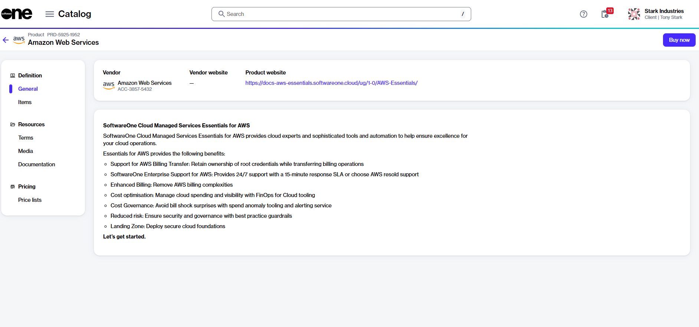
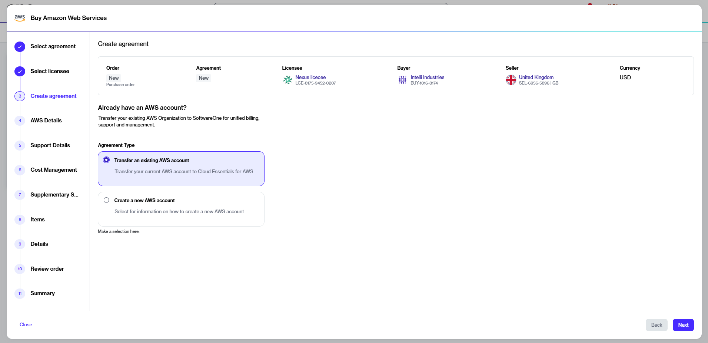

# Sign up for new AWS account

This tutorial describes how to sign up for a new AWS account through SoftwareOne Marketplace and then transfer the billing and management of that newly created account to SoftwareOne.&#x20;

### Prerequisites 

Before starting this tutorial, make sure you have the following:

* A unique email address for your AWS root account, a valid credit card, and your company contact details. These details are required to [sign up for AWS](https://signin.aws.amazon.com/signup?request_type=register).
* Correct permissions in your AWS account to complete the necessary account activation steps.
* An active licensee in the Marketplace Platform, or permission to [create a new one](https://docs.platform.softwareone.com/modules-and-features/settings/licensees/create-licensees). Selecting a licensee is required when creating a new agreement in the SoftwareOne Marketplace.
* Contact details of a technical person in your organization, who will be the point of contact during deployment in case of issues.

### Signing up for a new AWS account



**Start the Purchase Wizard for AWS**

To start the purchase wizard:

1. Navigate to the **Products** page.&#x20;
2. From the list of products, select **Amazon Web Services**.&#x20;
3. On the product details page, select **Buy now**. The Purchase Wizard for AWS starts.

<figure><figcaption>
The Buy now option on the product details page.
</figcaption></figure>




**Create a new agreement and a new AWS account**

In the Purchase Wizard, follow these steps to set up a new SoftwareOne Marketplace agreement and AWS account:

1. **Select agreement** - Select **Create agreement** to start creating your new agreement with SoftwareOne.
2. **Select licensee** - Choose a licensee. You can also [create a new licensee](../../../modules-and-features/settings/licensees/create-licensees.md) and select that licensee when it appears in the list. Select **Next**.&#x20;
3. **Create agreement** - Choose **Create a new AWS account**, then select **Next**.
4. **AWS details** - Follow these steps to set up your AWS account:


The following steps must be completed directly in the AWS Console.


1. [Sign up for AWS](https://signin.aws.amazon.com/signup?request_type=register). For details, see [How to create an AWS account](https://aws.amazon.com/resources/create-account/) in the AWS documentation.
2. Create a new AWS Organization and enable required organization features, including Service Control Policies (SCPs).
3. Configure services, such as AWS CloudTrail and CloudFormation StackSets.
4. Copy the 12-digit AWS Management Account ID. This ID must be provided in the next step.



**Transfer the billing and management of your newly created AWS account to SoftwareOne**

Once you have completed the sign-up process, return to the Purchase Wizard and follow these steps:

1. **AWS Details** - Select **Back** to return to the previous step containing the transfer option.

<figure><figcaption>
Follow the onscreen instructions to setup your AWS account.
</figcaption></figure>

2. **Create agreement** - Choose **Transfer an existing AWS account**, then select **Next**.&#x20;

<figure><figcaption>
Select the option to transfer your account.
</figcaption></figure>

3. **AWS details** - Do the following:
   1. Provide the 12-digit AWS Management Account ID of your newly created AWS organization.
   2. Review and update the contact form as necessary.
   3. Select **Next**.
4. **Support details** - Choose one of the support options, then select **Next**:
   * With **SoftwareOne Enterprise Support**, SoftwareOne becomes your point of contact for assistance with your AWS resources.&#x20;
   * If you opt for AWS Resold Support, you must contact AWS directly for technical assistance.&#x20;
5. **Cost management** - This step displays the Cost Management tools, including [FinOps for Cloud](../../finops-for-cloud/). Both options are selected by default and cannot be changed. Select **Next**.&#x20;
6. **Supplementary Services** - Select any additional AWS services you are interested in, then choose **Next**. This step indicates your interest in receiving more information. A SoftwareOne representative will contact you to discuss your selections further.
7. **Items** - This step displays the AWS Service item in your agreement. Do not remove this item. Select **Next**.
8. **Details** - Provide reference details, such as additional IDs or notes, and select **Next**.
9. **Review order** - Select the links for terms and conditions, and the privacy statement in the footer to read them. When done, select **Place order** to submit your order.



### Next steps

After you place the order, you will receive a confirmation message. You can check the [order details page](../../../modules-and-features/marketplace/orders/#order-details) for detailed information on the next steps, which include:

1. **Accepting the AWS billing transfer invitation** - You'll receive an invitation email from AWS. You must accept the invitation so we can proceed with your order.
2. **Approving the service terms** - You'll receive an email from AWS, requesting you to accept the minimum service term of your agreement.
3. **Deploying the SoftwareOne Bootstrap role** - After accepting the billing transfer invitation and the service terms, you must deploy the Essentials Bootstrap Role. Deploying this role is mandatory for onboarding. For more details, see [Essentials Bootstrap Role](https://docs.softwareone.cloud/knowledge-base/essentials-bootstrap-role-customer-manual) in SoftwareOne Services documentation.

You will also receive email notifications when these actions are due and require your attention.
