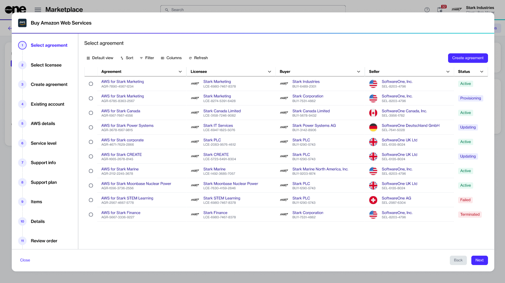

# Transfer Existing AWS Account

This tutorial describes how you can transfer your existing AWS accounts to the SoftwareOne Marketplace by establishing a new agreement.&#x20;

## Prerequisites 

Before you start this tutorial, make sure you understand the account transfer options that are available. See [Account Options](../account-options.md) to learn more. Additionally, you'll require the following:

* An active licensee within the Marketplace Platform, or permission to [create a new licensee](https://docs.platform.softwareone.com/modules-and-features/settings/licensees/create-licensees) if you prefer not to use an existing one. Selecting a licensee is required when setting up a new agreement.
* The IDs of the AWS accounts you want to transfer.

## Transferring your existing AWS account



**Start the purchase wizard for AWS**

To start the wizard:

1. Navigate to the **Products** page.&#x20;
2. From the list of products, select **Amazon Web Services**.&#x20;
3. On the product details page, select **Buy now**. The Purchase Wizard for AWS starts.

<figure><figcaption>
Buy now option on the product details page
</figcaption></figure>




**Follow the wizard to transfer your existing account**

<figure><figcaption>
Purchase wizard for AWS
</figcaption></figure>

Complete the following steps, making sure to enter or verify the required information where necessary:

1. **Select agreement** - Select **Create agreement** to start creating your new agreement with SoftwareOne.
2. **Select licensee** - Choose if you want to use an existing licensee or create a new one. In this tutorial, we will select an existing licensee. To add a new licensee, select **Add licensee** and follow the instructions in [Create licensee](../../../modules-and-features/settings/licensees/create-licensees.md).
3. **Create agreement** - Choose **Existing account**. Then, select **Next**.
4. **Existing account** - Choose one of the following options, and select **Next**:
   * **Transfer one or multiple accounts without an organization** - Select this option if you have standalone accounts, but not an AWS organization.
   * **Transfer my current AWS organization** - Select this option if you have an AWS master payer account with at least one associated linked account.
   * **Split the cost of your organization** - Select this option if you already have an agreement for AWS through the SoftwareOne Marketplace and want to split the cost among groups of linked accounts. You can do this by creating additional marketplace agreements that are all connected to the same AWS payer account.
5. **AWS details** - Do one of the following depending on the selection in the previous step, and select **Next**:

Transfer one or multiple accounts without an organization

If you selected **Transfer one or multiple accounts without an organization** in the previous ste&#x70;**:**

1. Provide your AWS Account ID. Make sure to include all account IDs so we can send the invitation link. After you have accepted the invitation link, we'll create an organization and subscriptions on the Marketplace Platform.
2. Review the **Notification contact** details. This contact will receive notification emails. By default, this section is prefilled with the information of your selected licensee.

Transfer my current AWS organization

If you selected **Transfer my current AWS organization** in the previous step, SoftwareOne Operations will contact you to transfer the payer account of your AWS organization.

Split the cost of your organization

If you selected **Split existing SoftwareOne marketplace agreements** in the previous step, do the following to split the costs between licensees:

1. **AWS master payer ID** - Enter the payer ID. To locate your AWS Master Payer ID, check your existing agreement. Navigate to the **Details** tab on the agreement details page and look under **Additional IDs** to find the **Vendor**. This number is for your master payer account that you want to split.
2. **Account name** - Enter a name for the member account you are about to create.
3. **E-mail** - Enter the email that will be used to create your first member account in AWS. Note that this email address must be unique and should not have been used in any other AWS account.

6. **Service level** - Select **Next**. This page displays all services you get as part of your agreement. It's not possible to change these options.
7. **Support info** - Choose a support plan and select **Next**. In this example, we will select **Resold support**. To learn about the support options, see [AWS Concepts](../aws-concepts.md).
8. **Items** - Review the details, then select **Next**. This section displays individual items that will be added to your order. To learn more, see My [AWS order contains additional items](../faqs/my-aws-order-contains-additional-items.md).
9. **Details** - Provide reference details, like additional IDs or notes, and select **Next**.
10. **Review order** - Read the terms and conditions and the privacy statement. When done, select **Place order** to submit your order.
11. **Summary** - Select **View details** to go to the order details page. Otherwise, select **Close** to exit the wizard.



## Next steps 

When your order has been placed, we verify the order details.&#x20;

If there are issues with your order, the [order details](../../../modules-and-features/marketplace/orders/#subscription-details)page will provide information about the problem and any actions you may need to take.&#x20;

If you transferred your AWS organization, you'll be contacted by SoftwareOne Operations, who will assist you further in completing the transfer process.

If you transferred standalone accounts, you'll receive invitations for all the accounts specified during the ordering process. To complete this process, you must sign in to each account as an administrator and accept pending invitations on the **Organizations** page within the AWS console.
