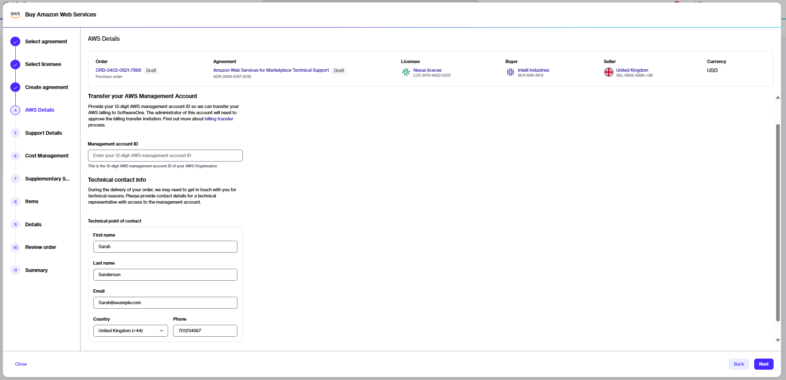
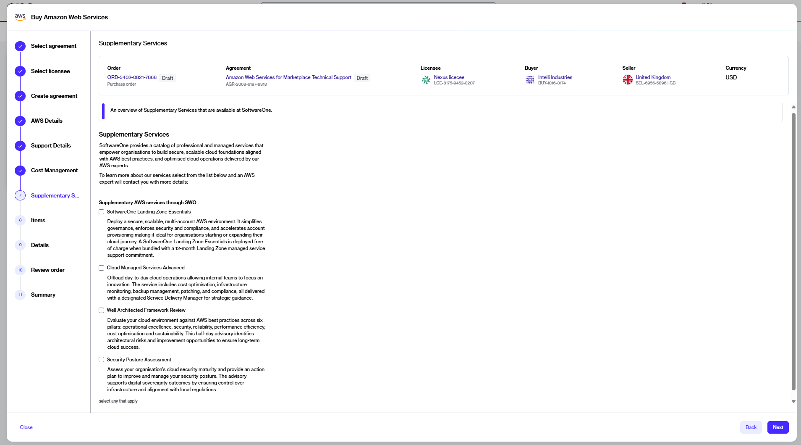

# Transfer your AWS account

This tutorial describes how you can transfer the billing and management for your existing AWS Management Account to SoftwareOne by establishing a new agreement.&#x20;

### Prerequisites 

Before starting this tutorial, make sure you have the following:

* The 12-digit Management Account ID of your AWS Organization.
* Contact details of a technical person within your organization. We might contact this individual during deployment in case of issues.
* An active licensee in the Marketplace Platform, or permission to [create a new licensee](https://docs.platform.softwareone.com/modules-and-features/settings/licensees/create-licensees). Selecting a licensee is required when creating a new agreement.

### Transferring your existing AWS account



**Start the Purchase Wizard for AWS**

To start the purchase wizard:

1. Go to **Catalog** > **Products**.&#x20;
2. From the list of products, select **Amazon Web Services**.&#x20;
3. On the **product details** page, select **Buy now**. The Purchase Wizard for AWS starts.

<figure><figcaption>
The Buy now option on the product details page.
</figcaption></figure>




**Complete the following steps to transfer your existing account**

In the Purchase Wizard, complete these steps:

1. **Select agreement** - Select **Create agreement** to start creating your new agreement with SoftwareOne.
2. **Select licensee** -  Choose a licensee. You can also [create a new licensee](https://docs.platform.softwareone.com/~/changes/362/modules-and-features/settings/licensees/create-licensees) and select that licensee when it appears in the list. Select **Next**.
3. **Create agreement** - Choose **Transfer an existing AWS account**, then select **Next**.

<figure><figcaption>
Select the option to transfer your account.
</figcaption></figure>

4. **AWS details** - Do the following:
   1. Provide the 12-digit AWS Management Account ID of your AWS organization.
   2. Review and update the contact form as necessary.
   3. Select **Next**.

<figure><figcaption>
Provide your Management Account ID and required contact details.
</figcaption></figure>

5. **Support details** - Choose one of the support options, then select **Next**:
   * With **SoftwareOne Enterprise Support**, SoftwareOne becomes your point of contact for assistance with your AWS resources.&#x20;
   * If you opt for **AWS Resold Support**, you must contact AWS directly for any technical assistance.&#x20;
6. **Cost management** - This step displays the Cost Management tools, including [FinOps for Cloud](../../finops-for-cloud/). Both options are selected by default and cannot be changed. Select **Next**.&#x20;
7. **Supplementary services** - Choose any additional AWS services of interest and select **Next**. Your selection indicates interest only. A SoftwareOne representative will follow up to provide more information.

<figure><figcaption>
Select any additional AWS services you are interested in.
</figcaption></figure>

8. **Items** - This step displays the AWS Service item in your agreement. Do not remove this item. Select **Next**.
9. **Details** - Provide reference details, such as additional IDs or notes, and select **Next**.
10. **Review order** - Select the links for terms and conditions, and the privacy statement in the footer to read them. When done, select **Place order** to submit your order.



### Next steps

After placing the order, you will receive a confirmation message. You can check the [order details page](../../../modules-and-features/marketplace/orders/#order-details) for information on the next steps, including:

1. **Accepting the AWS billing transfer invitation** - You'll receive an invitation email from AWS. You must accept the invitation so we can proceed with your order.
2. **Approving the service terms** - You'll receive an email from AWS, requesting you to accept the minimum service term of your agreement.
3. **Deploying the SoftwareOne Bootstrap role** - After accepting the billing transfer invitation and the service terms, you must deploy the Essentials Bootstrap Role. Deploying this role is mandatory for onboarding. For more details, see [Essentials Bootstrap Role](https://docs.softwareone.cloud/knowledge-base/essentials-bootstrap-role-customer-manual) in SoftwareOne Services documentation.

You will also receive email notifications when these actions are due and require your attention.
