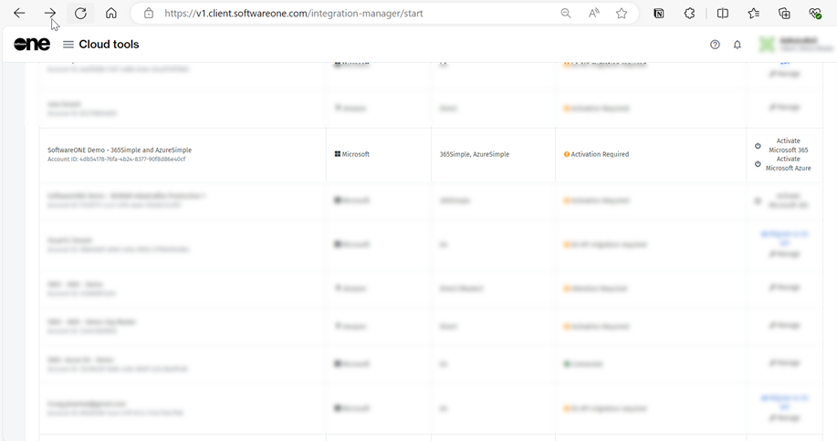

# Complete Your Microsoft 365 or Microsoft Azure Activation

If you purchased SoftwareOne's Digital Workplace Essentials/365Simple, and Azure Essentials/ AzureSimple services, you must activate your cloud account in the Marketplace Platform.&#x20;

Cloud accounts that require activation are displayed on the **Cloud tenant setup** page and have the **Activation Required** status and links to activate Microsoft 365 and Microsoft Azure, depending on the service you purchased.

This topic describes how you can access the **Cloud tenant setup** page and complete the activation.

## Activate Microsoft 365

Follow these steps to activate Microsoft 365:

1. Navigate to the **Cloud tenant setup** using one of the following steps:
   * Select this link: [Cloud tenant setup](https://v1.client.softwareone.com/integration-manager/start).
   * Sign in to the platform. Next, open the main menu and go to **Cloud tools** > **Cloud tenant setup**.
2. On the **Cloud tenant setup** page, locate the account that needs activation. The status will be **Activation Required**.
3. In the **Actions** column, click **Activate Microsoft 365**.&#x20;

<figure><figcaption>
Cloud tenant setup page
</figcaption></figure>

3. On the Microsoft sign-in page, enter your username and password. Note that you must provide your Global Administrator credentials.
4. Review the permissions and click **Accept** to grant consent.

## Activate Microsoft Azure

Follow these steps to activate Microsoft Azure:

1. Navigate to the **Cloud tenant setup** using one of the following steps:
   * Click this link: [Cloud tenant setup](https://v1.client.softwareone.com/integration-manager/start).
   * Sign in to the platform. Next, open the main menu and go to **Cloud tools** > **Cloud tenant setup**.
2. On the **Cloud tenant setup** page, locate the account that needs activation. The status will be **Activation Required**.
3. In the **Actions** column, click **Activate Microsoft Azure**.

<figure><figcaption>
Cloud tenant setup page
</figcaption></figure>

4. On the Microsoft sign-in page, enter your username and password. Note that you must have the **Owner** or **User Access Administrator** role for the account to activate.
5. Review permissions and click **Accept** to grant consent.

On successful validation of your credentials, your account is activated and the **Cloud tenant setup** page displays the activation status as **Connected**.
