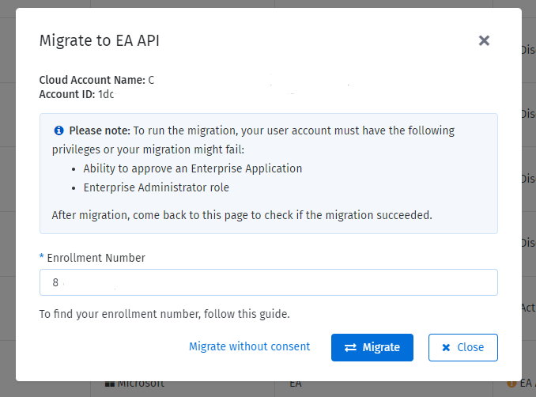

# Migrate to Azure Cost Management APIs

Microsoft will retire the legacy Azure Enterprise Reporting APIs on 1 May 2024. Currently, the Client Portal uses these APIs to get your Azure EA consumption data.&#x20;

If you have an Azure Enterprise Agreement (EA), you must migrate to the new Azure Cost Management APIs to maintain your cost and usage data in the Client Portal.&#x20;

## Before you begin

Before migrating to the new Cost Management APIs, note the following points:

* The new APIs don't require access tokens because the authorization is done through Microsoft Entra ID (also known as Azure Active Directory) using service principals.&#x20;
* Only individuals with the **Azure EA Enterprise Administrator** role permission can carry out the migration steps. If you have trouble finding out who is your EA admin in Azure, see Microsoft's documentation on [EA Billing administration on the Azure portal](https://learn.microsoft.com/en-us/azure/cost-management-billing/manage/direct-ea-administration#add-another-enterprise-administrator).&#x20;
* During the consent flow, the SoftwareOne Cloud Consumption app is added to the organization tenant. This enterprise application is granted the EA Reader permission, which allows us to read the consumption data. To add the application to the tenant, you'll need permission to approve an Enterprise Application.
* If your EA admin doesn't have access to the Client Portal, you can collaborate with them by sharing your screen, so your EA admin can sign in and complete the authorization required for migration.
* During migration, our system automatically assigns the [EnrollmentReader role permission](https://learn.microsoft.com/en-us/azure/cost-management-billing/manage/assign-roles-azure-service-principals#permissions-that-can-be-assigned-to-the-service-principal) to the service principal. &#x20;

## Migrating your existing EA cloud account

If you've already onboarded your EA cloud account to the Client Portal and have appropriate permissions to approve Enterprise Applications, follow these steps to transition to the new API:

1. Open the [Cloud Tenant Setup](https://v1.client.softwareone.com/integration-manager/start) page. EA cloud accounts that haven't been migrated will display **EA API migration required** in the **Status** column.

<figure><figcaption>
Status column displays EA API migration required
</figcaption></figure>

2. Click **Migrate EA API**.&#x20;
3. In the **Migrate to EA API** window, enter the enrollment number and click **Migrate**.&#x20;

<figure><figcaption>
Migrate option
</figcaption></figure>

4. Sign in to the Microsoft portal using the credentials of a user with **Enterprise administrator** permission.
5. On the consent page, review the permissions required by the Client Portal and click **Accept** to grant consent.

<figure><figcaption>
Permissions and consent
</figcaption></figure>

After clicking **Accept**, you'll be redirected to the **Cloud Tenant Setup** details page.&#x20;

The system will mark the enrollment number you provided as migrated, and automatically assign the **Enrollment reader** permission to the SoftwareOne Cloud Consumption (formerly PyraCloud Azure) application. When the migration is completed, the consumption data is fetched from Microsoft.


**Migration did not complete successfully?**&#x20;

If the migration fails despite following these steps, you can use the fallback option to complete the process.&#x20;

To do so, go to the **Enrollment Numbers** tab of the tenant and click **Show manual steps** in the **Actions** column. When the **Manual steps** dialog opens, execute the commands and then click **Close**.&#x20;

If you are still unable to migrate, contact your support team.


## Migrating without consent

If you cannot provide consent to approve enterprise applications or have environment restrictions, you can follow these steps to migrate and assign permissions manually:

1. On the [Cloud Tenant Setup](https://v1.client.softwareone.com/integration-manager/start) page, locate the required EA cloud account with the status **EA API Migration** required.

<figure><figcaption>
 EA API migration required
</figcaption></figure>

2. In the **Actions** column, click **Migrate EA API**.&#x20;
3. In the **Migrate to EA API** window, enter the enrollment number and click **Migrate without consent**.&#x20;

<figure><figcaption>
Migrate without consent 
</figcaption></figure>

4. On the details page of the tenant, select the **Enrollment Numbers** tab and click **Show manual steps**.
5. In **Manual steps**, assign permissions using Cloud Shell or REST API and click **Close**. Note that you must have the **Azure EA Enterprise Administrator** role to assign permissions.

## Enrollment statuses

The **Enrollment Numbers** tab on the details page of the cloud tenant displays the enrollment numbers that are migrated to the new API, along with the respective enrollment status:

<figure><figcaption>
Enrollment Numbers tab
</figcaption></figure>

* **Connected** - Indicates that the system is connected and working as expected.
* **Cannot Connect** - Indicates that the Client Portal doesn't have access to the new Azure Cost Management API and the **EnrollmentReader** permission is missing. You can assign permissions using the Azure Cost Management API or Azure Cloud Shell.
* **Activation Required** - Indicates that the Client Portal can access the enrollment data, but the cloud account has not been set up as an EA account type.

## Adding a new EA cloud account 

If you're adding a new EA cloud account to the Client Portal, you'll need to provide the enrollment number while adding the account. For information on how to add a new EA account, see [Activate your cloud account](activate-an-azure-ea-or-mpsa-account.md#activate-your-cloud-account).
