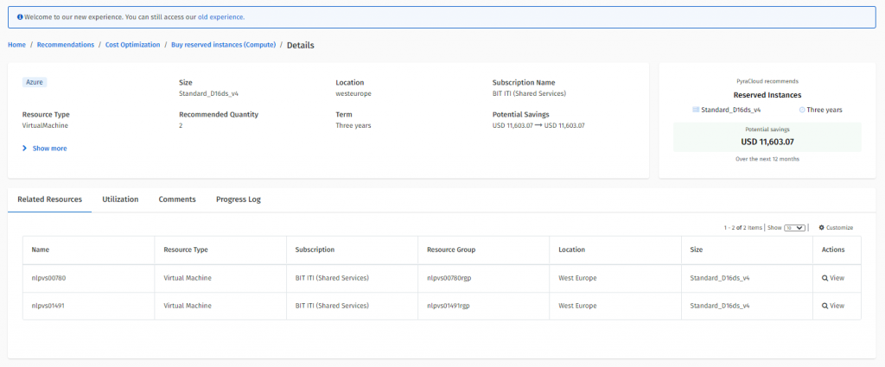

# Azure Recommendations

Microsoft Azure recommendations are divided into the following categories:

* **Savings** - These recommendations enable cost savings.
* **Risk** - These recommendations help mitigate compliance risk for licenses that may come from a non-compliance position.
* **Security** - These recommendations help to improve the security of an Azure environment.
* **High Availability** - These recommendations help to improve the availability of an Azure environment.
* **Performance** - These recommendations help improve the performance of an Azure environment.

All Azure Recommendations have a Cloud Recommendation type. The following are some examples of the Azure recommendations:

* Buy Reserved Instances
* Shutdown or Resize your Virtual Machine
* Security Center Recommendations
* Enable Soft Delete
* Enable Backup

## Associate recommendations with resources 

All Azure recommendations that are recommended by Azure (and not by SoftwareOne services) are automatically associated with resources whether they are virtual machines, storage accounts, or databases. For example, recommendations of **SQL DB Advisor recommendations** type are associated with SQL databases that need to be acted on.

The association from a recommendation to a related Client Portal resource is available on the **Related Resources** tab:

<figure><figcaption>
Related Resources tab
</figcaption></figure>

## Complete Azure recommendations 

The Client Portal can detect the completion of recommendations in Azure. When a recommendation is completed in Azure:

* The status of that recommendation is set to **Completed** in the Client Portal.&#x20;
* The potential savings amount on the recommendations is set to **Realised**.
* The recommendation is moved from the **Active** tab to the **Realised** tab.
* The realized savings from the recommendation are displayed on the **Savings** tile.


The Client Portal doesn't track the realization of Reserved Instance recommendations from Microsoft Azure. It means that when a Buy Reserved Instances or Renew Reserved Instances recommendation is completed, the Client Portal won't track any savings realized as part of completing these recommendations.


## Related topics


[Recommendations](https://app.gitbook.com/s/B8rr5E9BB4HBPts7pBng/extensions/cloud-tools/recommendations)



[View Recommendations](https://app.gitbook.com/s/B8rr5E9BB4HBPts7pBng/extensions/cloud-tools/recommendations/view-recommendations)



[Manage Recommendations](https://app.gitbook.com/s/B8rr5E9BB4HBPts7pBng/extensions/cloud-tools/recommendations/manage-recommendations)



[AWS Recommendations](https://app.gitbook.com/s/B8rr5E9BB4HBPts7pBng/extensions/cloud-tools/recommendations/aws-recommendations)



[Office 365 Recommendations](https://app.gitbook.com/s/B8rr5E9BB4HBPts7pBng/extensions/cloud-tools/recommendations/office-365-recommendations)

