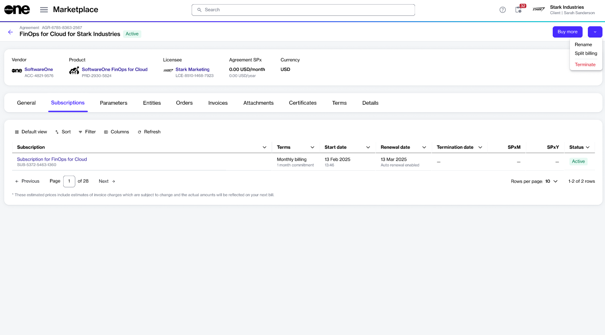

# Cancel Your FinOps Order

If you need to cancel your FinOps purchase order for any reason, for instance, if you picked the wrong currency while ordering, you can create a termination order for the agreement linked to your order. This tutorial describes how you can do this.


Terminating the agreement disables the corresponding organization in FinOps. It means you will no longer be able to access any data related to this organization, such as your data sources, pools, and users. Additionally, you won't be able to sign in or switch to this organization in FinOps.&#x20;


## Prerequisites 

Before cancelling your FinOps order, ensure that the agreement linked to the purchase order is **active**. If it's not active, you won't be able to start the termination process.&#x20;

## Canceling your FinOps for Cloud order



**Start the Terminate Agreement wizard**

To start the wizard:

1. Navigate to the **Agreements** page.
2. Select the agreement to terminate.
3. On the agreement details page, select the arrow and choose **Terminate**.

<figure><figcaption>
Terminate option on the agreement details page
</figcaption></figure>




**Follow the wizard to cancel your order**

Complete the following steps in the Terminate Agreement wizard. Make sure to enter or verify the required information on each page.

1. **Items** - Make sure the new item quantity is displayed as 0. Then, select **Next**.
2. **Order details** - Add or update the additional ID and other details as necessary. When done, select **Next**.
3. **Review order** - Use the links in the footer to read the terms and conditions. Then, select **Place order** to submit your termination order.
4. **Summary** - Select **View order** to open the order details page. Otherwise, select **Close**.&#x20;



## Next steps

After you have submitted the termination order, you can view real-time updates and status on the [order details](../../modules-and-features/marketplace/orders/#subscription-details) page.

When your order has been processed, both the agreement and the subscription associated with the order will be marked as **Terminated** in the Marketplace Platform, and the corresponding organization will be disabled in FinOps.
