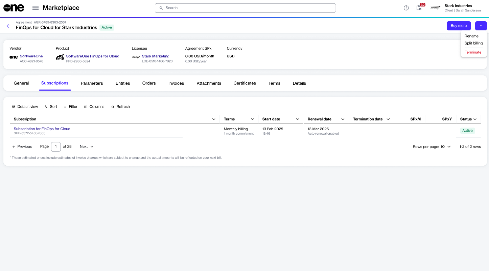

# Cancel your FinOps for Cloud order

This tutorial describes how to cancel your FinOps purchase order by submitting a termination order for the agreement.


Terminating the agreement disables the corresponding organization in FinOps.&#x20;

It means you cannot sign in or switch to this organization and access data such as data sources, pools, and users.


### Prerequisites 

Ensure that the agreement linked to the purchase order is currently active.&#x20;

### Cancelling your FinOps for Cloud order



**Start the termination process**

To start the process:

1. Go to **Marketplace** > **Agreements**.
2. Select the agreement you want to terminate.
3. On the agreement details page, select the dropdown arrow, then choose **Terminate**.

<figure><figcaption>
The Terminate option on the agreement details page.
</figcaption></figure>




**Follow the steps to cancel your order**



1. **Items** – Make sure the new item quantity is `0`, then select **Next**.
2. **Order details** – Add or update the additional ID and other details as necessary. When done, select **Next**.
3. **Review order** – Use the links in the footer to read the terms and conditions. Then, select **Place order** to submit your termination order.
4. **Summary** – Select **View order** to open the order details page or select **Close**.&#x20;



### Next steps

After submitting the order, you can view real-time order updates on the order details page.

When your order has been processed, both the agreement and the subscription are marked as Terminated, and the corresponding organization is disabled in FinOps.
