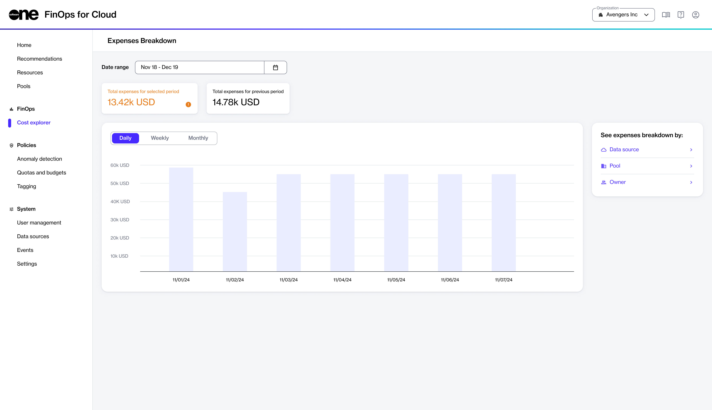

# Cost Explorer

The Cost Explorer in FinOps for Cloud offers tools and options for analyzing costs and understanding the cost structure within your organization.

## Cost explorer interface

You can access the Cost explorer from the sidebar. This page displays the total expenses for the selected period and allows you to compare them with the total expenses from the previous period. This comparison helps you understand your overall spending and identify any trends or changes in your spending patterns.

<figure><figcaption>
Cost explorer
</figcaption></figure>

* **Date range** - Use this option to change the date range to adjust it to their specific needs, providing flexibility in analyzing costs over different time frames.
* **Time interval** - Allows you to change the time interval shown on the graph to **Daily**, **Weekly**, or **Monthly**. This allows for a more detailed or broader view of cost trends over different periods.
* **See expenses breakdown by** - Shows a more detailed bar chart with a pie chart displaying the data, and includes a table with detailed information. You can explore and analyze more details by using the option to see an expenses breakdown by **Source**, **Pool**, or **Owner**.
