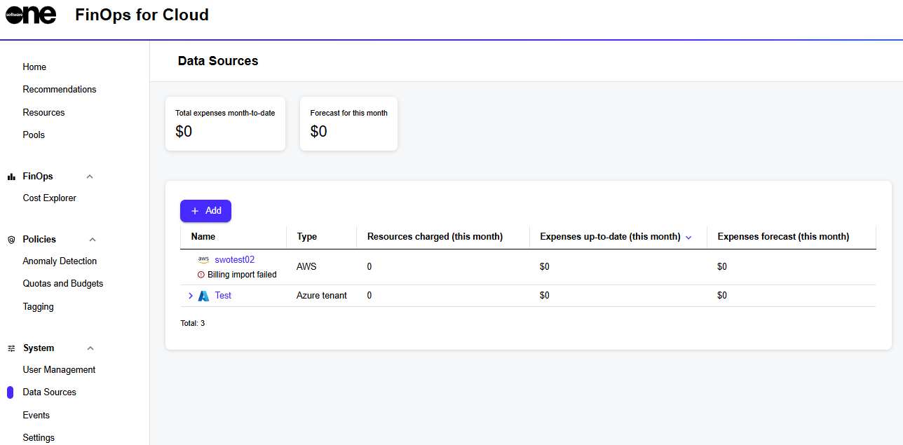

# Data Sources

The **Data Sources** page lets you add a new billing data source of your cloud account to FinOps for Cloud. You can access this page from the sidebar. The following types of data sources are currently supported:

* AWS Root
* AWS Linked
* Azure Tenant
* Azure Subscription
* Google Cloud

To track a new data source in your account, click **Add** on the **Data Sources page** and then select the source you wish to connect.&#x20;

<figure><figcaption>
Data Sources page
</figcaption></figure>

After connecting your account, the data source appears on the page. By clicking on it, you access the details page where you can view properties and manage the data source, including options to rename it, update credentials, and disconnect.

For information on how to connect a data source, see the following pages:

* [AWS Root Account with Data Export Already Configured](aws/aws-root-account-with-data-export-already-configured.md)
* [AWS Root Account with No Data Export Configured](aws/aws-root-account-with-no-data-export-configured.md)
* [AWS Linked](aws/aws-linked.md)
* [Google Cloud Platform](google-cloud-platform.md)
* [Microsoft Azure](microsoft-azure.md)
