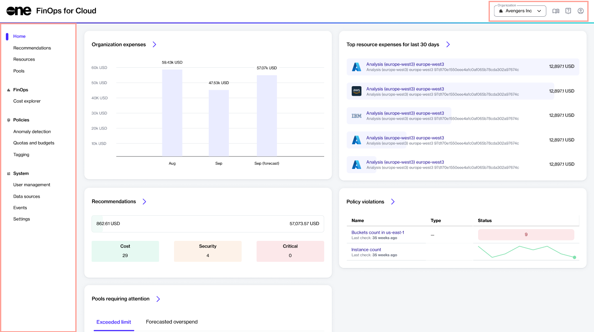

# FinOps for Cloud Interface

FinOps for Cloud is split into different sections for ease of navigation and usability:

<figure><figcaption>
FinOps for Cloud UI
</figcaption></figure>

## Sidebar

The sidebar is your entry point for accessing the following pages:

* **Home** - Find your organization’s current spending and projected expenses for the upcoming month.&#x20;
* **Recommendations** - Get practical information about suggesting services and features available in FinOps for Cloud. Find a brief description and other pertinent information in the cards to help you assess the situation quickly.
* **Resources** - Observe the expenses for all resources across all connected clouds within the organization for the selected period. Organize and categorize resources based on your specific requirements.
* **Pools** - View pools with limits or projected expenses that require your attention. Manage pools using the available features on this page.
* **FinOps** - View a breakdown chart that visualizes your expenses over time, and get a visual or analytical representation of costs.
* **Policies** - Identify and respond to unusual patterns or deviations from normal behavior, control costs and manage resources efficiently, implement robust tagging policies, and manage the resource lifecycle and automated power on/off schedules effectively.
* **System** - Assign roles to users for resource management, integrate with various services, and view events.

## Organization selector 

If you belong to several organizations in FinOps for Cloud, you can switch between those organizations using the **Organizations** menu in the upper right.&#x20;

To see an overview of all organizations and key information for each organization, select **Organization overview**. Organizations that require attention and optimization are marked in red on the **Organizations overview** page.

## Documentation, product tour, and profile buttons

You can find the following options in the header:

 - _Documentation_ - Select to access the product documentation for FiOps for Cloud.&#x20;

 - _Product tour_ - Select to get the product tour.

 - _Profile_ - Select to sign out of the FiOps for Cloud platform.&#x20;
