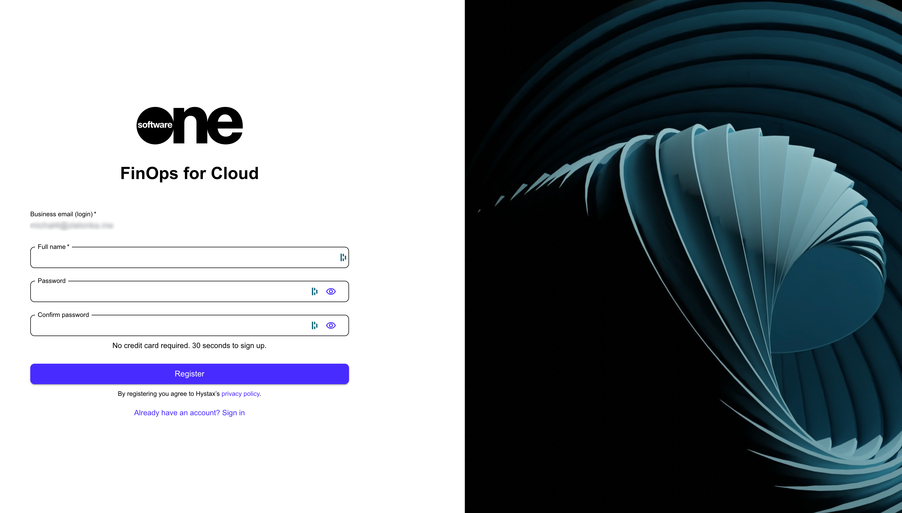

# First-Time Login

After SoftwareOne or your administrator adds you to your organization’s FinOps for Cloud account, you'll receive an invitation email with a link to join your account.

Open the invitation email and follow these steps to complete the sign-in process:

1. In your invitation email, click the link to open the FinOps tool.
2. On the sign-up page, enter your first and last name and choose a password for your account.&#x20;
3. Retype the password in the **Confirm password** field and click **Register**. You'll receive a verification code by email.

<figure><figcaption>
Sign in page
</figcaption></figure>

4. Enter the confirmation code on the sign-in page and click **Confirm**. You'll then be signed in to the tool. Use the same credentials each time you wish to sign in to your account.&#x20;
