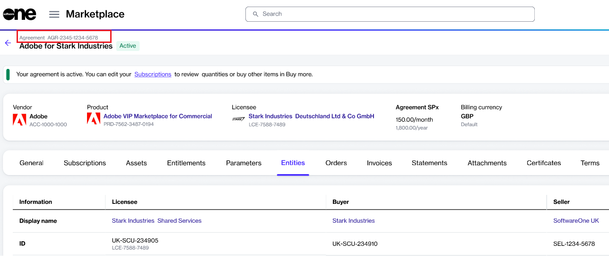

# Home Page

The Home page is the first page that appears when you sign in to FinOps for Cloud.&#x20;

This page contains various sections, each displaying the most popular pages. You can access the main page of any section by clicking the arrow-forward icon<path d=&#x22;m321-80-71-71 329-329-329-329 71-71 400 400L321-80Z&#x22;/></svg>" data-size="line">. The main page is where further detailed information is available.

<figure><figcaption>
Home page
</figcaption></figure>

The Home page contains the following sections:

* **Organization expenses** - View the total expenses of the previous month, the expenses of the current month, and this month's forecast. The red line on the chart shows the expense limit.
* **Top resource expenses for the last 30 days** - Control the resources with the highest expenses. In addition, view the Perspectives or "Go to the resources" via buttons near the caption.
* **Recommendations** - Find summary cards with possible monthly savings, and expenses separated into cost, security, and critical categories. Click the card caption to get details on the Recommendations page.
* **Policy violations** - Pay special attention to the status field. If it's red, it means the policy has been violated.
* **Pools requiring attention** - Navigate between tabs to see the **Exceeded limit** or **Forecast overspend** pools. Use the buttons in the **Actions** column to see the resources list and cost explorer.
