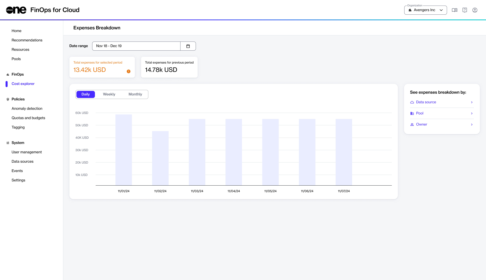

# Cost Explorer

The Cost Explorer in FinOps for Cloud offers tools and options for analyzing costs and understanding the cost structure within your organization. You can access the Cost Explorer from the sidebar.&#x20;

The page displays the total expenses for the selected period and allows you to compare them with the total expenses from the previous period.

<figure><figcaption>
Cost explorer
</figcaption></figure>

Use the comparison to help understand your overall spending and identify any trends or changes in your spending patterns. The Cost Explorer page contains the following options that you can use to view a breakdown of your expenses:

* **Date range** - Use this to adjust the date range as needed. The date range selector offers flexibility in analyzing costs over different time frames.
* **Time interval** - Use this to change the time interval on the graph. You can change the time interval to **Daily**, **Weekly**, or **Monthly**. This allows for a more detailed or broader view of cost trends over different periods.
* **See expenses breakdown by** - Allows you to explore and analyze the expense breakdown by **Source**, **Pool**, or **Owner**. When you select any of these options, a detailed pie chart and data summary is displayed.
