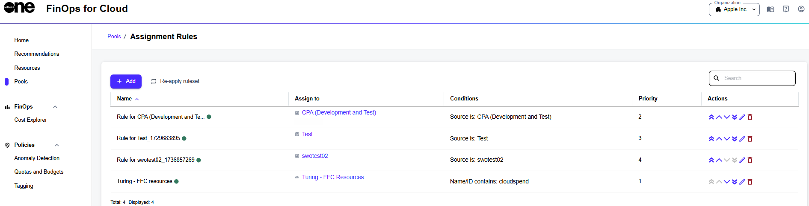
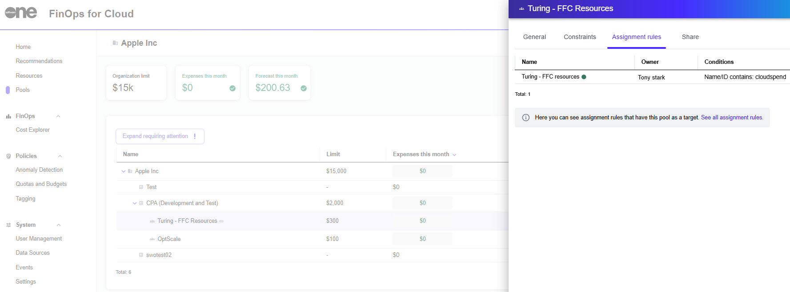

# Pools

Strong resource assignment improves efficiency, reduces costs, enhances accountability, and helps projects stay on track, all of which contribute to higher overall success rates in organizational and project management contexts.

Newly created resources are distributed among pools based on assignment rules. If they have certain tags, they will immediately be assigned to the appropriate pool as soon as they are first discovered. If they don't belong to any pool, they will be assigned to the data source pool. The data source pool is created when the data source is connected.

FinOps for Cloud allows you to manage assignment rules by viewing, creating, editing, and changing their priority.&#x20;

## Assignment rules page

The **Configure assignment rules** option on the **Pools** page displays the **Assignment Rules** page.&#x20;

<figure><figcaption>
Assignment rules page
</figcaption></figure>

From this page, you can [add new assignment rules](add-assignment-rules.md) and view all the existing rules along with the following details:&#x20;

* **Name** - Displays the name of the rule.
* **Assign to** - Displays the pool and the owner to whom the resource is assigned.
* **Conditions** - Displays a summary of the conditions that trigger the rule.
* **Priority** - Displays the priority used to apply assignment rules to resources.
* **Actions** - Displays options that allow you to manage the rule, such as:
  *  - _prioritize_ - Sets the rule priority to the highest. The priority of the other rules is decreased by one.
  *  - _promote_ - Increases rule priority by 1. The rule is swapped with the previous rule.
  *  - _demote_ - Decreases rule priority by 1. The rule is swapped with the rule behind it.
  *  - _deprioritize_ - Assigns the rule with the lowest priority across the given organization. All other affected rules are updated.
  *  - _edit_ - Allows modification of an existing rule. You can adjust conditions and assignment details, ensuring that the rule remains accurate and up to date with changing requirements. A rule can be enabled or disabled by selecting the **Active** checkbox. Active rules are marked with green dots next to their names, inactive ones are marked with grey dots.
  *  - _delete_ - Removes the rule from the list.

From this page, you can do the following:&#x20;

* Add a new automatic resource assignment rule. See [Adding assignment rules](./#add-assignment-rule) for instructions.
* Re-apply the ruleset to the current ruleset to all resources in the selected pool, even if they were explicitly assigned earlier. See [Re-applying a ruleset](./#re-apply-ruleset) for instructions.
* Search for a specific rule based on criteria such as Name, Assigned to, Conditions, and Priority.


FinOps assigns newly detected resources automatically according to the listed rules. Rules are evaluated according to priority. You can also force re-apply them for the whole organization or a specific pool if you need to reflect allocation policy changes immediately.


## Pool-related assignment rules 

This feature provides quick access to the assignment rules that apply to a given pool.&#x20;

It shows how resources are assigned and managed within the pool, ensuring transparency and simplifying rule verification and modification by centralizing relevant rules in one place.&#x20;

To find a list of assignment rules associated with the selected pool, open the pool details page and select the **Assignment rules** tab:

<figure><figcaption>
Assignment rules
</figcaption></figure>

Each rule entry includes the rule's **Name**, **Owner**, and **Conditions**, providing a clear overview of the rule configurations.

The **Conditions** column contains a detailed summary of the conditions defined for each rule, including condition types such as Name/ID contains, Tag is, or Source is.

Selecting **See all assignment rules** displays the main assignment rules listing page, where you can manage all rules across different pools.
