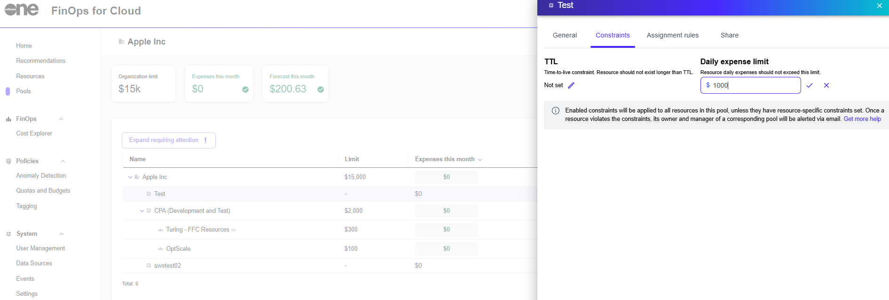

# Pool Constraint Policies

The **Constraints** option within Pools allows you to implement policies for the entire pool, instead of a single resource.&#x20;

An individual with a **Manager** role can enforce all resources in the pool to share constraints so that they are applied to all resources in the pool. Custom resource-specific constraints can still exist and yet override the general policy.

To apply the pool constraint policies:

1. On the **Pools** page, select a pool group or its sub-pool.
2. Select the **Constrains** tab and click the edit iconto enter values in the **TTL** or **Daily expense limit** fields.
3. Select  to save your changes. The constraint will be applied to all resources in the pool.

<figure><figcaption>
Pool constraint policies
</figcaption></figure>


A constraint will not be visible if the related resource has already been deleted from FinOps or if a resource has been tracked only by imported billing data.

