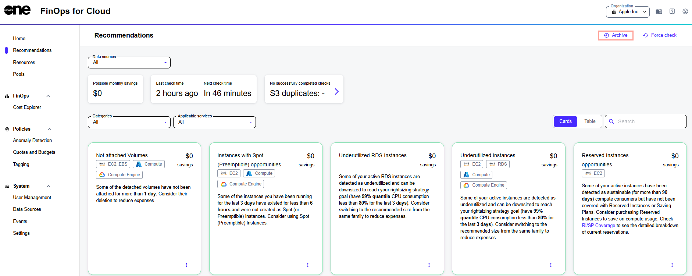

# Archived Recommendations

If a recommendation has been applied or has become irrelevant, it is moved to the archive.&#x20;

To view archived recommendations, select **Archive** in the upper right on the **Recommendations** page.

<figure><figcaption>
Archive option on the Recommendations page
</figcaption></figure>
