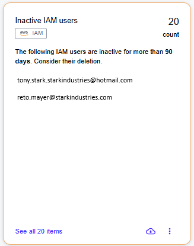

# Security Recommendations

## Inactive IAM users 

Users who have been inactive for more than **90 days** are considered obsolete and subject to deletion. This is due to the security risks they produce for the organization as they can be compromised and become access points for malicious users.&#x20;

The number of days is a custom parameter. Use [Settings](./#settings) to change it. You can also download a list of inactive users as JSON or XLSX by selecting the download icon <path d=&#x22;M480-160q-33 0-56.5-23.5T400-240q0-33 23.5-56.5T480-320q33 0 56.5 23.5T560-240q0 33-23.5 56.5T480-160Zm0-240q-33 0-56.5-23.5T400-480q0-33 23.5-56.5T480-560q33 0 56.5 23.5T560-480q0 33-23.5 56.5T480-400Zm0-240q-33 0-56.5-23.5T400-720q0-33 23.5-56.5T480-800q33 0 56.5 23.5T560-720q0 33-23.5 56.5T480-640Z&#x22;/></svg>" data-size="line">.

<figure><figcaption>
Inactive IAM users
</figcaption></figure>

## Instances with insecure Security Groups settings 

Security check that browses through the resources to find network vulnerabilities and provides a list of instances liable to RDP/SSH hacking. The following are the insecure ports and permissions:

* port tcp/22
* port tcp/3389
* all inbound traffic

with one of:

* CidrIp: 0.0.0.0/0
* CidrIpv6: ::/0

**AWS**

* Describe regions: _ec2.describe\_regions()_
* Describe instances: _ec2.describe\_instances()_
* Describe security groups: _ec2.describe\_security\_groups()_

**Azure**

* Describe instances: _compute.virtual\_machines.list\_all()_
* Describe security groups: _network.network\_security\_groups.list\_all()_


Network interfaces without associated security groups are skipped.


You can download the list of insecure Security Groups as JSON for subsequent automated processing.

## IAM users with unused console access 

The active IAM users that have console access turned on, but have not used it for more than **90 days** are in the list. Consider revoking console access to increase security.

Note that the number of days is a custom parameter. Use [Settings](./#settings) to change it.

## Public S3 buckets 

The S3 buckets in the list are public. Ensure that the buckets use the correct policies and are not publicly accessible unless explicitly required.
