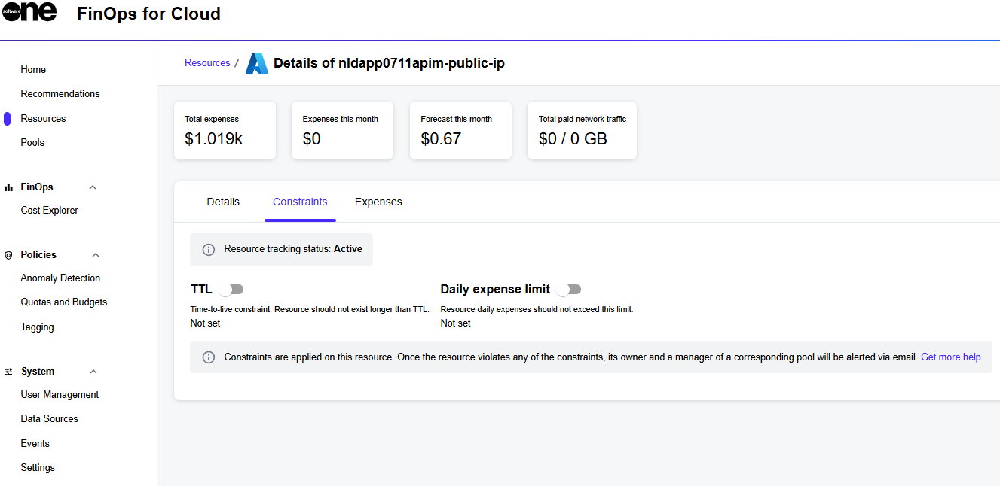
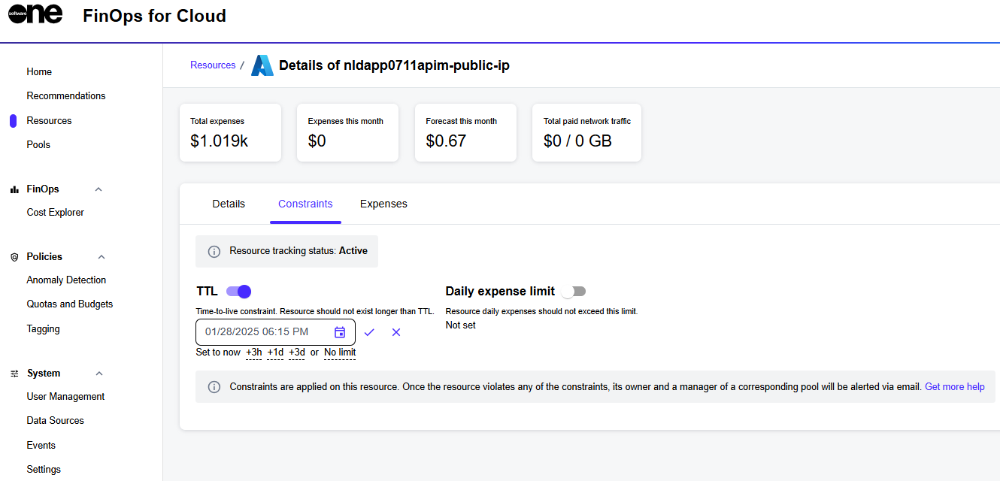

# Constraints

To address the ever-dynamic cloud infrastructure where resources are being created and deleted continuously, FinOps for Cloud contains a set of tools to help limit the related expenses and the lifetime of individual assets.&#x20;

This is implemented in the form of constraints that you can set for a specific resource or generally for a pool. You can set two types of constraints:

* **TTL** - Represents time to live. A resource must not live for more than the specified period.&#x20;
  * For a resource, specify a date and time.&#x20;
  * For a pool, input an integer between 1 and 720 hours.
* **Daily expenses limit** - The resource spending must not exceed the specified amount in dollars. Input as an integer, min $ 1, 0 - unlimited.

When FinOps discovers active resources in the connected source, it checks that they don't violate any existing pool constraints that were applied as policies before.

When a resource hits a constraint, both the Manager and Owner of the resource are alerted through email. If a resource is unassigned, alerts are sent to the organization managers. An exclamation mark also appears next to the pool name on the **Pools** page.


FinOps for Cloud sends notifications about violated constraints and doesn't interact with the connected source itself to perform any constraint-related adjustments.


## Assigning resource constraints 

To assign resource constraints:

1. On the **Resources** page, select the required resource.
2. On the resource details page, select the **Constraints** tab.

<figure><figcaption>
Constraints tab
</figcaption></figure>

3. Use the slider to enable the required setting. Then, select edit  to enter the value. When done, select  to save your changes.

<figure><figcaption>
Available constraint type
</figcaption></figure>


If a resource doesn't have a specific constraint set, it inherits the policies from its Pool. However, the resource owner or manager can override an existing Pool constraint policy for an individual resource by issuing a custom constraint for any given asset.

