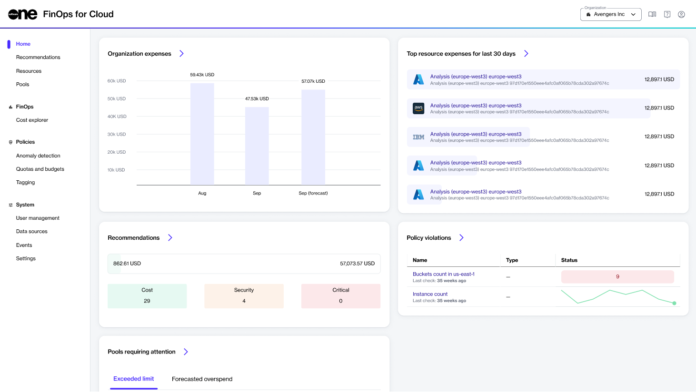

# Interface

FinOps for Cloud is split into different sections for ease of navigation and usability:

<figure><figcaption>
Home page
</figcaption></figure>

## Sidebar

The sidebar is your entry point for accessing the following pages:

* **Home** - Find your organization’s current spending and projected expenses for the upcoming month. View recommendations, policy violations, and your top resource expenses on a single dashboard.&#x20;
* **Recommendations** - View recommendations to get the most out of your registered data sources and other practical information about suggested services and features in FinOps for Cloud. See [Recommendations](../cloud-tools/recommendations/) to learn about the different types of recommendations.
* **Resources** - View and allocate the expenses for the cloud resources, monitor their performance, and set constraints. See [Resources](insights/resources/) to learn how to organize and categorize resources based on your specific requirements.
* **Pools** - View pools with limits or projected expenses. Resources can be categorized into a hierarchy of pools manually or using assignment rules. See [Pools](insights/pools/) for information on how to set TTL rules or budget limits for individual resources and all the resources in a pool.
* **Cost explorer** - View a breakdown chart that visualizes your expenses over time and get a visual or analytical representation of costs. See [Cost Explorer](insights/cost-explorer.md) to learn more.
* **Policies** - Identify and respond to unusual patterns or deviations from normal behavior, control costs and manage resources efficiently, implement robust tagging policies, and manage the resource lifecycle and automated power on/off schedules effectively. See [Anomaly Detection](policies/anomaly-detection/), [Quotas and Budgets](policies/quotas-and-budgets/), and [Tagging Policies](policies/tagging/) for details.
* **System** - Invite your team members and assign roles through [User Managemen](system/user-management.md)t, view [system events](system/events.md), and manage [organization settings](system/settings.md). To start with cost management, connect a billing [data source](system/data-sources/) of your cloud account to FinOps for Cloud.&#x20;

## Main dashboard

The dashboard displays your organization’s current spending and projected expenses for the upcoming month. It has various sections, each displaying the most popular pages. You can access the main page of any section by selecting the forward arrow<path d=&#x22;m321-80-71-71 329-329-329-329 71-71 400 400L321-80Z&#x22;/></svg>" data-size="line">. The main page is where further detailed information is available.

* **Organization expenses** - Displays the total expenses of the previous month, the expenses of the current month, and this month's forecast. The red line on the chart shows the expense limit.
* **Top resource expenses for the last 30 days** - Displays the resources with the highest expenses. You can view the expenses in **Perspectives** or select a resource name to open the details page of the resource.
* **Recommendations** - Displays summary cards with possible monthly savings. You can also view the expenses separated into categories, such as **Cost**, **Security**, and **Critical**. Select the link within the card to view the details on the [Recommendations ](insights/recommendations/)page.
* **Policy violations** - Displays all policy violations. You can also view the policy name and type. Select the policy name to open the details page of the policy. Pay special attention to the **Status** field. If it's red, it means the policy has been violated.&#x20;
* **Pools requiring attention** - Contains tabs where you can see the **Exceeded limit** or **Forecast overspend** pools. Use the buttons in the **Actions** column to see the resources list and cost explorer.

## Organization selector 

If you belong to several organizations in FinOps for Cloud, you can switch between those organizations using the **Organization** menu on the page.

To see an overview of all organizations and key information for each organization, select **Organization overview**. Organizations that require attention and optimization are marked in red on the **Organizations overview** page.

## Documentation and profile buttons

You can find the following options in the header:

 - Select to access the documentation for FinOps for Cloud. You'll then be redirected to a detailed documentation page.&#x20;

 - Select to sign out of your account.&#x20;
