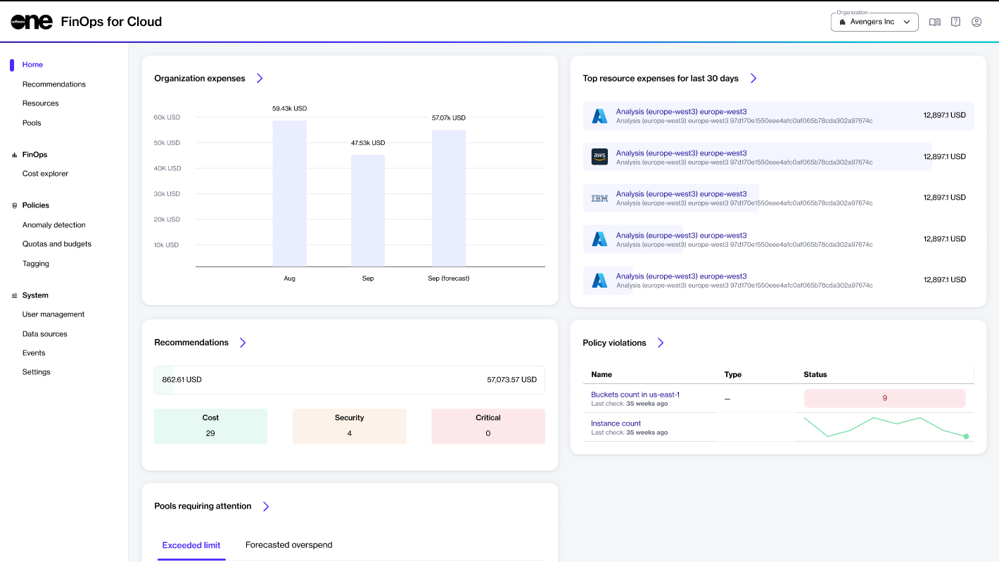

# Home Page

The **Home** page in FinOps for Cloud displays your organization’s current spending and projected expenses for the upcoming month.&#x20;

<figure><figcaption>
Home page
</figcaption></figure>

It contains various sections, each displaying the most popular pages. You can access the main page of any section by clicking the forward arrow<path d=&#x22;m321-80-71-71 329-329-329-329 71-71 400 400L321-80Z&#x22;/></svg>" data-size="line">. The main page is where further detailed information is available.

* **Organization expenses** - View the total expenses of the previous month, the expenses of the current month, and this month's forecast. The red line on the chart shows the expense limit.
* **Top resource expenses for the last 30 days** - Control the resources with the highest expenses. In addition, view in Perspectives or see resource details by clicking the resource name.
* **Recommendations** - Find summary cards with possible monthly savings, and the expenses separated into cost, security, and critical categories. Click the link in the card to view the details on the **Recommendations** page.
* **Policy violations** - View all policy violations. Pay special attention to the **Status** field. If it's red, it means the policy has been violated.
* **Pools requiring attention** - Navigate between the tabs to see the **Exceeded limit** or **Forecast overspend** pools. Use the buttons in the **Actions** column to see the resources list and cost explorer.
