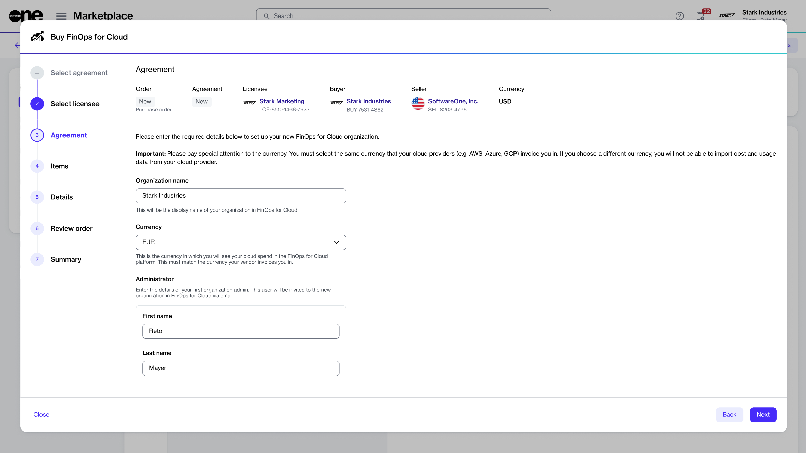
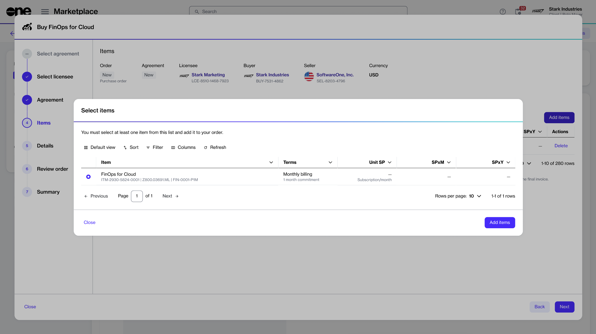

# Order FinOps for Cloud from Marketplace

You can order FinOps for Cloud subscription from the SoftwareOne Marketplace. The following steps describe how to place an order by creating a new agreement.&#x20;

### Prerequisites 

Before starting this tutorial, make sure you have the following:

* A licensee in the **active** state or permission to [create a new licensee](https://docs.platform.softwareone.com/modules-and-features/settings/licensees/create-licensees) (if you don't want to use an existing licensee). You'll need to select the licensee when setting up the new agreement.
* The contact details of the administrator who will manage your FinOps account. Details include the admin's name and email address. After your order has been placed, we'll email the login details to the administrator you specified.&#x20;

### Implementation



**Navigate to the Products page**

The **Products** page is located under **Marketplace** in the main navigation menu. The page displays all products available to order from the SoftwareOne Marketplace.



**Launch the purchase wizard for FinOps for Cloud**

From the list of products, select **SoftwareOne FinOps for Cloud**. Then, on the details page, select **Buy now** to start the purchase wizard.

<figure><figcaption>
Buy now option on the product details page
</figcaption></figure>



**Follow the steps in the purchase wizard**

1. In the **Select agreement** step, select **Create agreement** to start creating your new agreement.
2. In the **Select licensee** step, choose if you want to use an existing licensee or create a new one. In this tutorial, we'll select an existing licensee. You can [add a new licensee](../../modules-and-features/settings/licensees/create-licensees.md) by selecting **Create licensee**.
3. In the **Agreement** step, provide the following details, then select **Next**:
   1. **Organization name** - (Required) Enter the name of your organization. This name represents your environment in FinOps for Cloud. You can update the name later from the **Settings** page within FinOps.&#x20;
   2. **Currency** - (Required) Select the currency that your cloud service provider bills you in.&#x20;
   3. **Administrator** - (Required) Fill out the contact form. You'll need to enter the contact details of the administrator who will manage your account. This admin will be assigned the **Organization admin** role in FinOps.


When selecting a **Currency**, make sure to choose the correct one, as it can't be changed after the agreement has been created. You must select the same currency that your cloud provider (like AWS or Azure) uses for billing. For example, if you are billed in USD, you must select **USD** from the list. If you choose a different currency, you won't be able to import the cost and usage data from your cloud provider.


<figure><figcaption>
Agreement step in the wizard
</figcaption></figure>

4. In the **Items** step, do the following:
   1. Choose **SoftwareOne FinOps for Cloud**. Then, select **Add items** to add it to your order.&#x20;
   2. Select **Next** to continue.

<figure><figcaption>
Items step in the wizard
</figcaption></figure>

5. In the **Details** step, provide reference details, like additional IDs or notes, then select **Next**.
6. In the **Review order** step, read the terms and conditions and the privacy statement. When done, select **Place order** to submit your order.
7. In the **Summary** step, select **View details** to go to the order details page. Otherwise, select **Close** to exit the wizard.



### Next steps

Once your order is placed, we will verify the details and process your order. You can use the **General** tab on the [order details](../../modules-and-features/marketplace/orders/#subscription-details) page to keep track of your order. If there are any issues, the details page will provide information about the problem and any actions you may need to take.

After the order is complete, we'll email your account administrator with instructions on [signing in to your FinOps account](https://portal.finops.softwareone.com/). After signing in, admins can connect data sources to start importing data.&#x20;

To learn about connecting data sources and using FinOps for Cloud, see the [FinOps for Cloud documentation](https://docs.finops.softwareone.com/).
