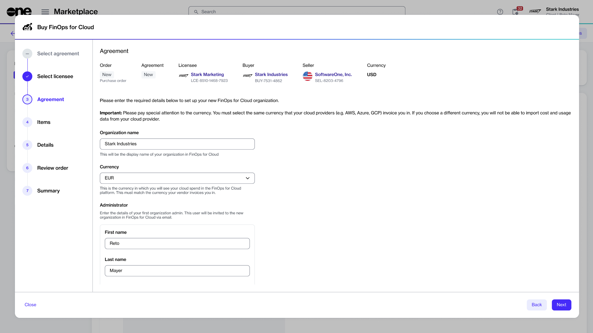
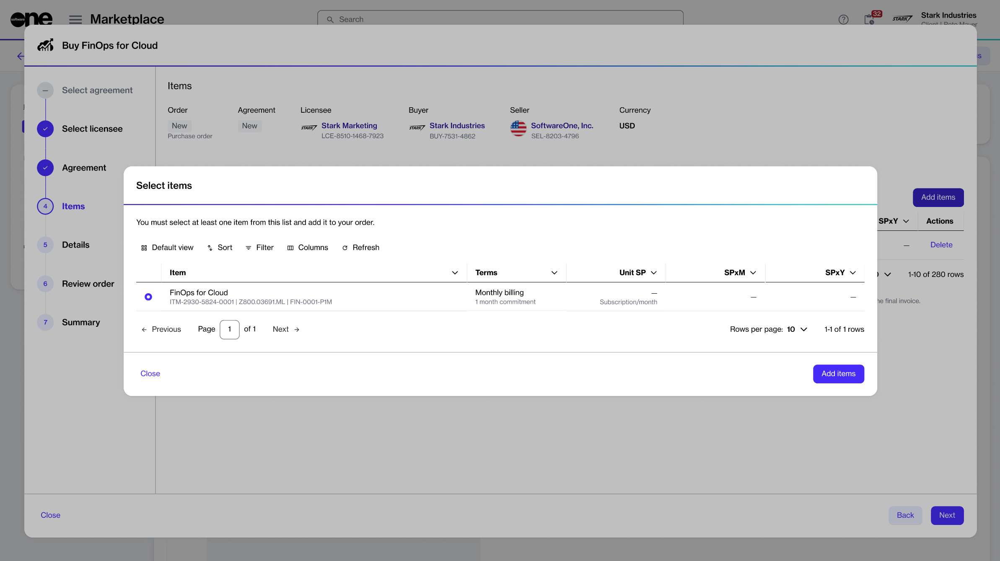

# Order FinOps for Cloud from Marketplace

This tutorial describes how you can order a FinOps for Cloud subscription from the SoftwareOne Marketplace. This tutorial focuses on creating a new agreement.&#x20;

### Prerequisites 

Before starting this tutorial, make sure you have the following:

* A licensee in the **active** state or permission to [create a new licensee](https://docs.platform.softwareone.com/modules-and-features/settings/licensees/create-licensees). Licensee selection is required to set up a new agreement.
* Contact details of the administrator who will manage your FinOps account. You must provide the admin's name and email address, so we can email the login details to the administrator.&#x20;

### Ordering FinOps for Cloud from Marketplace





To start the process:

1. Go to **Catalog** > **Products**.
2. Select **SoftwareOne FinOps for Cloud**.&#x20;
3. On the details page, select **Buy now**.&#x20;

<figure><figcaption>
The Buy Now option on the product details page.
</figcaption></figure>




**Create your agreement and add the FinOps item to your order**

Complete the following steps:

1. **Select agreement** – Select **Create agreement** to start creating the new agreement.
2. **Select licensee** – Select an existing licensee. You can also [add a new licensee](../../modules-and-features/settings/licensees/create-licensees.md) by selecting **Create licensee**.
3. **Agreement** – Provide the following details, then select **Next**:
   1. **Organization name** – (Required) Enter the name of your organization. This name represents your environment in FinOps for Cloud. If required, you can update the name later from the **Settings** page in FinOps.&#x20;
   2. **Currency** – (Required) Select the currency you are currently billed in by your service provider.&#x20;
   3. **Administrator** – (Required) Complete the contact form. You must provide the contact details of the administrator managing your account. This admin is assigned the **Organization admin** role in FinOps.


Make sure to choose the correct currency, as it can't be changed after the agreement has been created. The currency must be the same currency that your cloud provider (like AWS or Azure) uses for billing. For example, if you are billed in USD, you must select USD from the list. If you choose a different currency, you cannot import the cost and usage data from your cloud provider.


<figure><figcaption>
Use the Agreement step to provide your organization details.
</figcaption></figure>

4. **Items** – Choose **SoftwareOne FinOps for Cloud**, then select **Add items**. Select **Next**.

<figure><figcaption>
Select Add items to add SoftwareOne FinOps for Cloud to your order.
</figcaption></figure>




**Review and submit the order**

To review the details and place your order:

* **Details** – Enter the reference details, then select **Next**.
* **Review order** – Read the terms and conditions and the privacy statement. When done, select **Place order** to submit your order.
* **Summary** – Select **View details** to open the order details page or select **Close**.



### Next steps

After you place the order, we'll verify the details.

You can track your order using the order details page

After your order is complete, we'll email your account administrator with instructions on [how to sign in to your FinOps account](https://portal.finops.softwareone.com/). After signing in, your administrator can connect the data source to start importing data.&#x20;

For more details, see the [FinOps for Cloud documentation](https://docs.finops.softwareone.com/).
