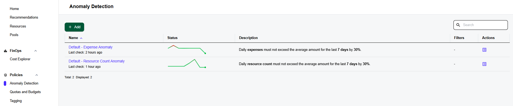
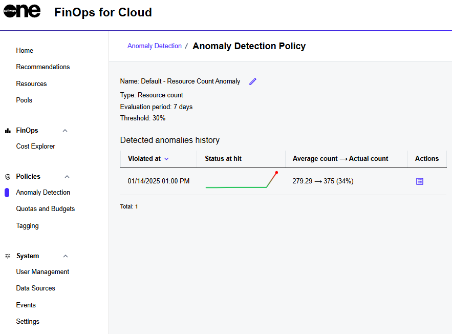

# Anomaly Detection

Anomaly detection is an integral part of a cloud security and management strategy, helping you preemptively address potential issues before they cause significant damage or disruption. Cloud anomaly detection is crucial for maintaining the integrity and performance of cloud services.

In FinOps for Cloud, you can find the **Anomaly detection** page in the **Policies** section of the sidebar. The page provides information about all anomalies that have been created under your specified policies.

<figure><figcaption>
Anomaly detection page
</figcaption></figure>

You can track the dynamics in the **Status** column and hover over it to view the average and current values. The filters show the instances in which this policy is available. An en dash (–) in the **Filters** column means the policy is available for all cases.

To view detailed information for a policy, select the policy name. You can then view the general information, date of violation, status, average, and actual counts for easy comparison and a quick assessment of the situation. You can also modify the policy name. Clicking the **Actions** icon displays all resources.

<figure><figcaption>
Anomaly detection details page
</figcaption></figure>
