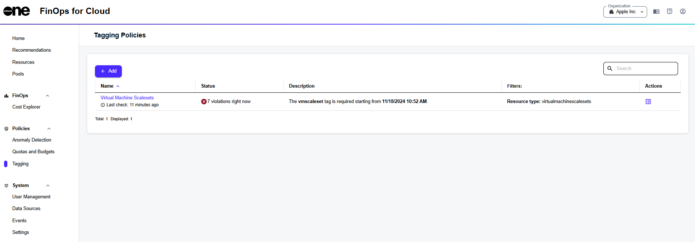

# Create Tagging Policies

in FinOps for Cloud, you can create multiple tagging policies. For example, you can create a policy that applies to all resources and another policy that applies to certain resource types.&#x20;

New policies can be created using the **Add** option on the **Tagging policies** page.

<figure><figcaption>
Add option on the Tagging policies page
</figcaption></figure>

To create a new tagging policy:

1. On the **Tagging policies** page, select **Add**. The **Create tagging policy** page opens.&#x20;
2. Enter the name for the new policy and specify the date when the policy must start.
3. Choose whether the policy requires certain tags, prohibits certain tags, or defines a correlation between tags.
4. (Optional) Use filters to choose specific resources for the new policy. These filters help define the criteria for the policy.
5. Select **Save**. The new policy is saved and applied to the relevant resources. You can view the new policy on the **Tagging Policies** page.
