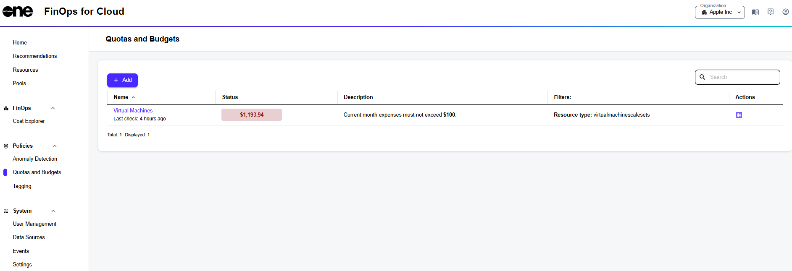

# Quotas and Budgets

FinOps for Cloud lets you manage and optimize cloud costs. It aims to help you manage cloud resources effectively, ensuring cost optimization and compliance with budget constraints.&#x20;

Setting budgets and quotas is a core feature that allows you to control cloud spending. Budgets in cloud storage refer to the financial limits an organization sets to manage the costs associated with cloud storage usage. Quotas limit the storage resources a user, application, or department can consume.

## Quotas and Budgets interface

You can find **Quotas and Budgets** in the **Policies** section of the sidebar.

<figure><figcaption>
Quotas and Budgets page
</figcaption></figure>

The **name**, **status**, **description**, and **filter** fields show information about your existing quotas or budgets. The type of budget can be easily detected by the description:

| Type of budget   | Description                                          |
| ---------------- | ---------------------------------------------------- |
| Resource Quota   | Resource count must not exceed 10.                   |
| Recurring Budget | Current month expenses must not exceed $100.         |
| Expiring Budget  | Total expenses from 01/01/2024 must not exceed $100. |
