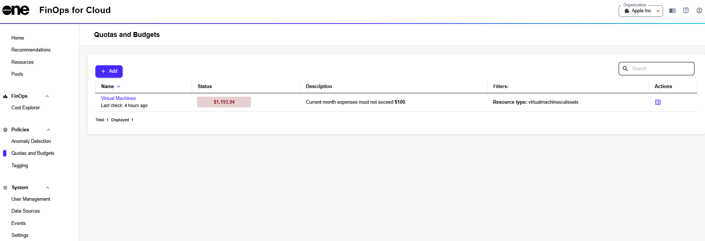

# Create Quota or Budget Policy

If you have the ‘Organization manager’ permission, you can create a new quota or budget policy using the **Add** option on the **Quota and Budgets** page.

<figure><figcaption>
Add option on the page
</figcaption></figure>

Follow these steps to create a new policy:

1. On the **Quota and Budgets** page, click **Add**. The **Create Quota or Budget Policy** page opens.&#x20;
2. Enter the name and select the type. Additional fields appear according to the selected type.&#x20;
3. Enter data into these fields. If necessary, set data source, pool, owner, and other filter options.&#x20;
4. Click **Save**.

The new policy is created and displayed on the **Quotas and Budgets** page. Use the Status field to view the current resource count or expense value. The quota itself can be found in the **Description** field.&#x20;

If this value exceeds the quota or budget, the progress bar turns red. In other cases, it turns green. The progress bar’s occupancy also shows how close the current value is to the set threshold values. &#x20;
