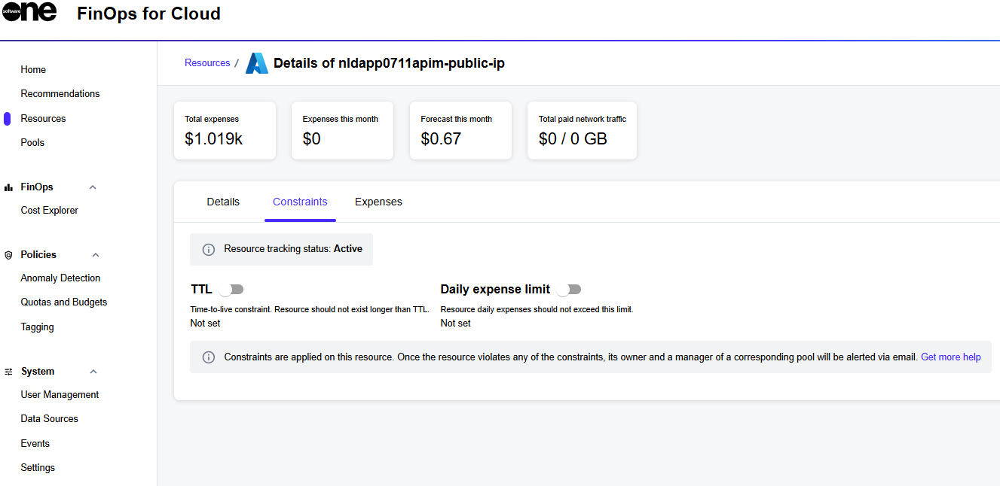
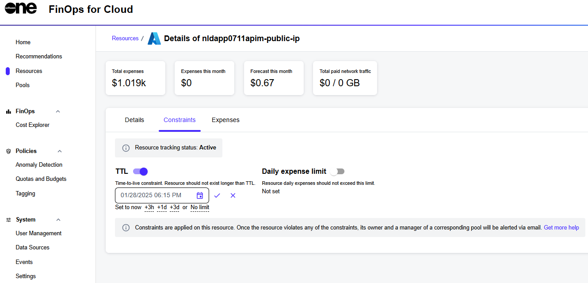
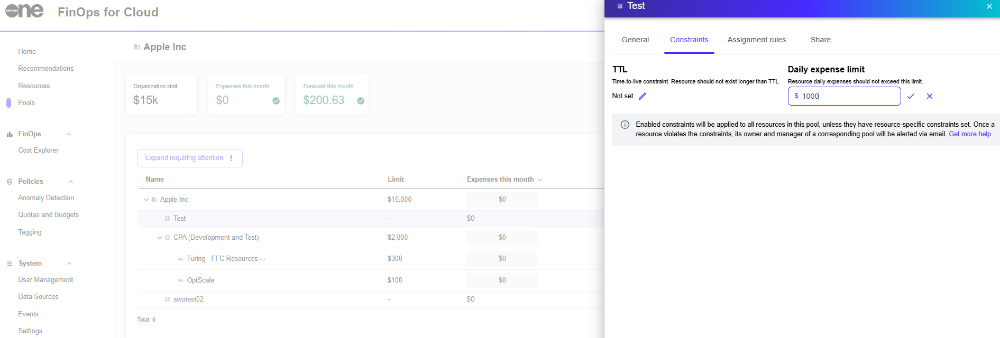

# Resources Constraints and Pool Constraint Policies

To address the ever-dynamic cloud infrastructure where resources are being created and deleted continuously, FinOps for Cloud introduces a set of tools to help limit the related expenses and the lifetime of individual assets.&#x20;

The following feature is implemented in the form of _constraints_ that you can set for a specific resource or generally for a pool. Two constraint types can be set:

* **TTL** - Represents time to live. A resource should not live for more than the specified period.&#x20;
  * For a resource, specify a date and time.&#x20;
  * For a pool, input an integer between 1 and 720 hours.
* **Daily expenses limit** - The resource spending should not exceed the specified amount in dollars. Input as integer, min $ 1, 0 - unlimited.

When FinOps discovers active resources in the connected source, it checks that they don't violate any existing pool constraints that were applied as policies before.

When a resource hits a constraint, both the Manager and Owner of the resource are alerted through email. If a resource is unassigned, alerts are sent to the organization managers. An exclamation mark also appears next to the pool name on the **Pools** page.


FinOps for Cloud sends notifications about violated constraints and doesn't interact with the connected source itself to perform any constraint-related adjustments.


## Assigning resources constraints 

Follow these steps to assign resource constraints:

1. On the **Resources** page, select the required resource. The details page of your selected resource opens.
2. Select the **Constraints** tab.

<figure><figcaption>
Constraints tab
</figcaption></figure>

3. On the **Constraints** tab, use the slider to enable the required setting, and then click edit  to enter the value. Click to save your changes.

<figure><figcaption>
Available constraint type
</figcaption></figure>


If a resource doesn't have a specific constraint set, it inherits the policies from its Pool. However, the resource owner or manager can override an existing Pool constraint policy for an individual resource by issuing a custom constraint for any given asset.


## Pool constraint policies 

This is a more high-level setting that facilitates the flow in a way that allows implementing policies for entire Pools instead of a single resource. Thus, a manager can enforce all resources in the Pool to share constraints so that they are applied to all resources in this Pool, while custom resource-specific constraints can still exist and yet override the general policy.

To apply pool constraint policies:

1. On the **Pools** page, select a pool group or its sub-pool.
2. Select the **Constrains** tab and click the edit iconto enter values in the **TTL** or **Daily expense limit** fields.
3. Click to save your changes.

<figure><figcaption>
Pool constraint policies
</figcaption></figure>


A constraint won't be visible if the related resource has already been deleted from FinOps or if a resource has been tracked only by imported billing data.


## Deleting a pool 

You can change the Pool structure by deleting unnecessary pools. The option to delete a pool is unavailable for pools that sub-pools. In such cases, you must delete the sub-pools first. &#x20;

Additionally, to delete a pool, you must have the Manager role in the parent of the pool you want to delete.


Deleting a pool is irreversible. The system will ask for confirmation before deletion.


Follow these steps to delete a pool:

1. On the **Pools** page, click the delete icon in the **Actions** column. A delete confirmation message is displayed.
2. Select the **I understand and want to delete this pool** checkbox.&#x20;
3. Click **Delete**.&#x20;

When a pool is deleted, all resources are reassigned to its parent pool, and all rules that used to point to this pool are redirected to its root.
