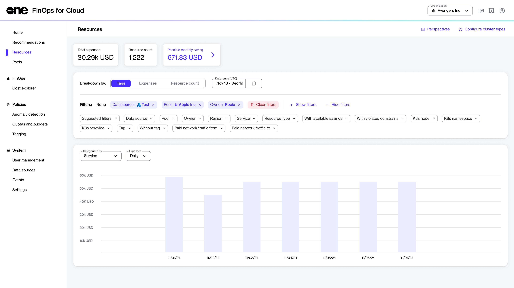

# Resources

The **Resources** page provides a comprehensive overview of various cloud resources, their usage, and their associated costs. This page helps you monitor your cloud resources and manage them effectively.&#x20;

## Resources interface

In FinOps for Cloud, you can access the **Resources** page from the sidebar.  The page displays the data for your cloud resource usage and expenses in the graphical format as well as table.&#x20;

* **Graphic visualization** - This includes various types of graphs, such as bar charts and line graphs, helping you understand trends, patterns, and anomalies in your cloud resource usage and expenses.
* **Tabular data** - This provides detailed information in tabular format, allowing you to see specific data points and metrics. The tables include columns for different parameters, such as resource type, cost, usage, tags, owner, and more.

<figure><figcaption>
Resources page
</figcaption></figure>

The **Resources** page contains the following options:

* **Total expenses** - Displays a summary of the total costs incurred during the selected period. Use this section to view your overall spending on cloud resources and identify areas where you can optimize costs.
* **Resource count** - Displays the total number of resources considered during the selected period. Use this section to gain insights into the scope of your resource usage and manage your cloud infrastructure more effectively.
* **Possible monthly savings** - Provides an estimate of potential savings based on recommendations. Use this section to identify cost-saving opportunities and optimize your cloud resource usage.
* **Breakdown by** - Allows you to adjust the view by breaking down the data according to different parameters.
  * **Tags** - Group and analyze data based on tags assigned to resources, making it easier to track and manage resources according to specific criteria.
  * **Expenses** - View the cost breakdown by different expense types, helping users identify which areas are incurring the most costs.
  * **Resource Count** - Analyze the number of resources being used, providing insights into resource allocation and utilization.
* **Date range** - Allows you to apply a custom date range to view the appropriate data. This feature provides flexibility in analyzing cloud resource usage and expenses over different periods.
* **Filters** - Allows you to apply various filters to customize your data view. This includes filtering by resource type, owner, expense type, tags, and more. You can combine multiple filters to refine your analysis and view only the relevant data.&#x20;
* **Categorize by** - Use this filter to categorize data by parameters, such as Region, Data Source, Owner, and Pool.
* **Expenses** - Use this filter to view expenses on a **Daily**, **Weekly**, or **Monthly** basis.
* **Group by** - Group the data by Pool, Owner, or Tag.

### Additional features 

* **Save perspective** - You can save your current perspective, including all applied filters and settings, for future use. This ensures that you can quickly return to your preferred view without reconfiguring filters each time.
* **Use saved perspectives** - You can select a perspective from a list of saved perspectives and switch between different views. This feature is useful if you need to analyze data for different purposes.
* **Configure cluster types** - You can configure cluster types by assigning a corresponding tag key to resources. Upon discovery, resources with the specified tag key are assembled into a cluster. Deleting a cluster type causes an immediate disassembly of all clusters of that type, and reapplying the cluster type results in a full reassembly of the clusters.
