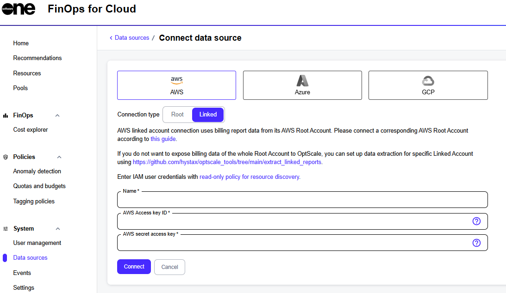

# AWS Linked

FinOps for Cloud supports the AWS Organizations service that allows linking several Data Sources to centrally manage the data of multiple users while receiving all billing exports within a single invoice.

Selecting **AWS Linked** makes the registration flow easier, eliminating the option to input bucket information for billing purposes. Bucket information is received through the root account, whose user can distribute periodic reports individually if intended by the company management.&#x20;

Provide the **AWS access key ID** and **AWS secret access key**, and click **Connect** to create a Data Source in FinOps. If the provided values are invalid, an error message is displayed.

<figure><figcaption><p>AWS Linked option on the Connect Data Source page</p></figcaption></figure>


If you only specify an **AWS-linked account** without providing credentials for the main one, FinOps for Cloud won't be able to import any billing data.


### Discovering resources <a href="#discover-resources" id="discover-resources"></a>

FinOps for Cloud needs to have permissions configured in AWS for the user Data Source to correctly discover resources and display them under a respective section of the dashboard for the associated employee.

Make sure to include the following policy for FinOps to parse EC2 resource data:

```json
{
    "Version": "2012-10-17",
    "Statement": [
        {
            "Sid": "FinOpsforCloudOperations",
            "Effect": "Allow",
            "Action": [
                "s3:GetBucketPublicAccessBlock",
                "s3:GetBucketPolicyStatus",
                "s3:GetBucketTagging",
                "iam:GetAccessKeyLastUsed",
                "cloudwatch:GetMetricStatistics",
                "s3:GetBucketAcl",
                "ec2:Describe*",
                "s3:ListAllMyBuckets",
                "iam:ListUsers",
                "s3:GetBucketLocation",
                "iam:GetLoginProfile",
                "cur:DescribeReportDefinitions",
                "iam:ListAccessKeys"
            ],
            "Resource": "*"
        }
    ]
}
```

Your AWS Data Source is ready for integration with FinOps for Cloud.
