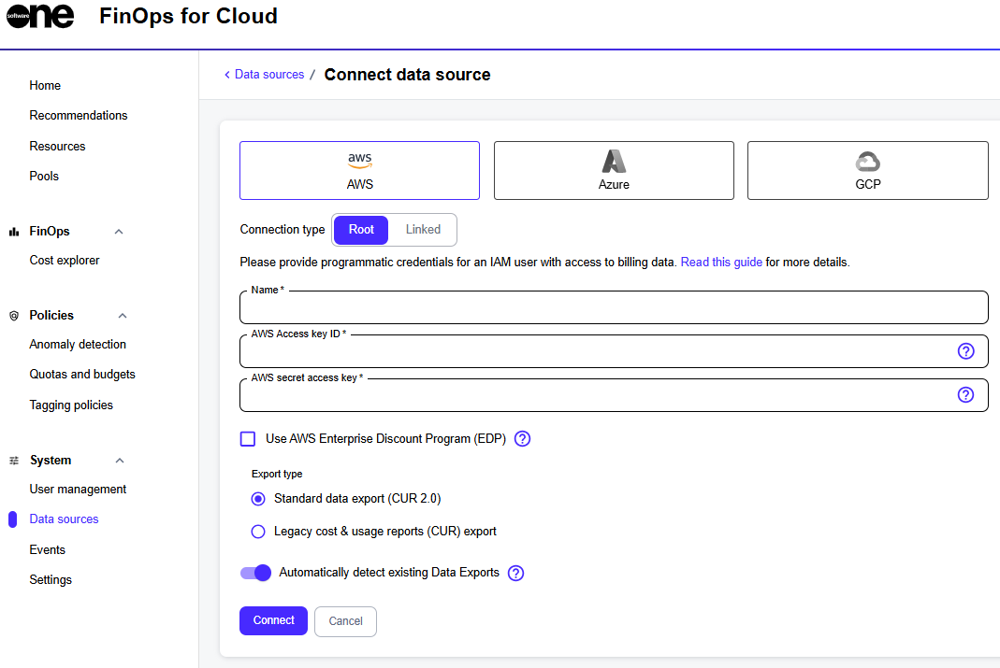
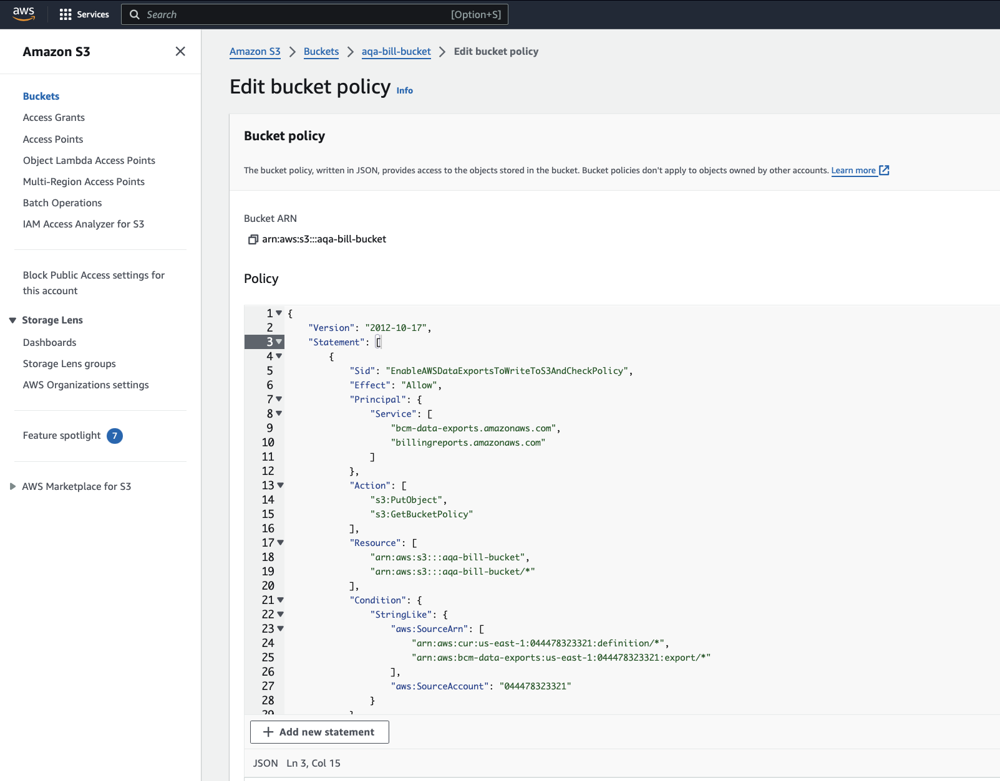
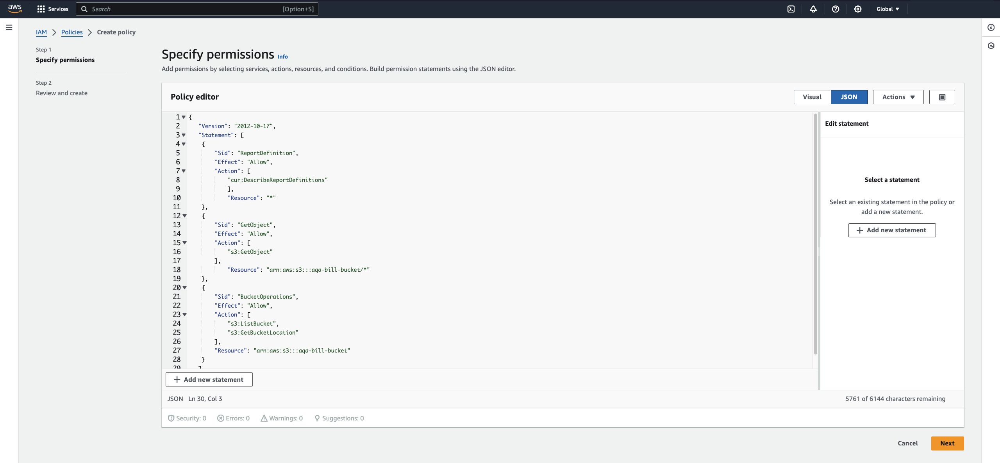
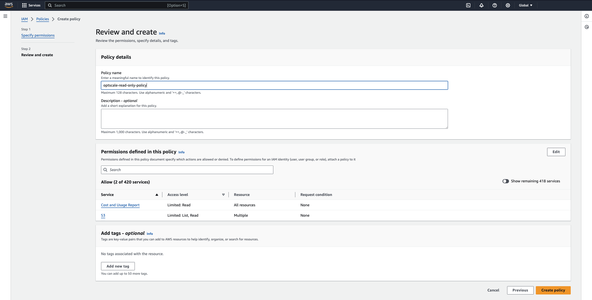
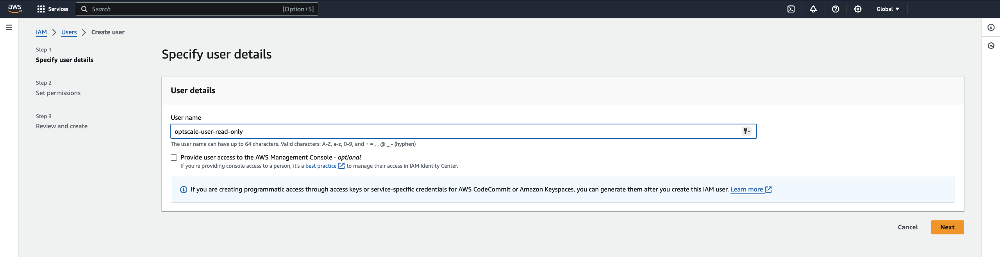
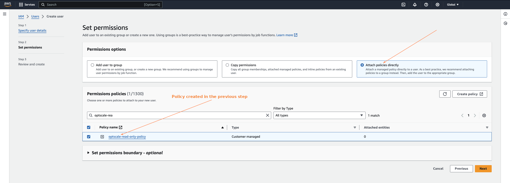
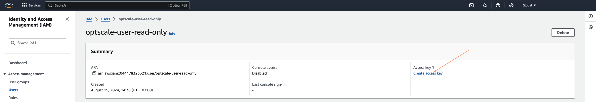
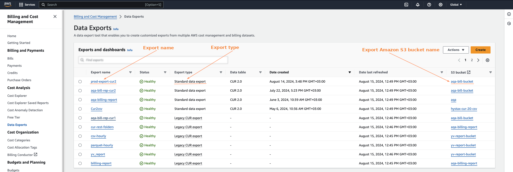
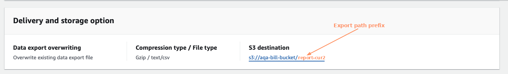

# AWS Root Account with Data Export Already Configured

FinOps for Cloud supports the AWS Organizations service that allows linking several Data Sources to centrally manage the data of multiple users while receiving all billing exports within a single invoice.

The Root account (payer) is the only one with access to collective data related to cloud spending. When registering this type of profile, the user is given an option for Data Exports to be detected automatically.


If you connect the root account but don't connect linked accounts, all expenses from the unconnected linked accounts are ignored, even if they exist in the data export file. To retrieve expenses from both linked and root accounts, connect all AWS accounts (not just the root). FinOps for Cloud ignores data from unconnected linked accounts.


To track a new AWS Data Source in your account, select **AWS Root** on the **Connect Data Source** page:&#x20;

<figure><figcaption><p>AWS Root option on the Connect Data Source page</p></figcaption></figure>

## Automatic billing data import in AWS <a href="#automatic-billing-data-import-in-aws" id="automatic-billing-data-import-in-aws"></a>

### Prerequisites

Make sure that data export is configured for your cloud account. If data export hasn't been configured, see [AWS Root Account With No Data Export Configured](aws-root-account-with-no-data-export-configured.md).

### Implementation



### Update bucket policy

1. Navigate to the **Permissions** tab of your AWS S3 bucket and select **Bucket Policy**.
2. Replace `<bucket_name>` with the name of the bucket.
3. Replace `<AWS account ID>` with the AWS account ID (12 digits without “-”):

```json
{
  "Version": "2012-10-17", 
  "Statement": [
      {
          "Sid": "EnableAWSDataExportsToWriteToS3AndCheckPolicy",
          "Effect": "Allow",
          "Principal": {
              "Service": [
                  "billingreports.amazonaws.com",
                  "bcm-data-exports.amazonaws.com"
              ]
          },
          "Action": [
              "s3:PutObject",
              "s3:GetBucketPolicy"
          ],
          "Resource": [
              "arn:aws:s3:::<bucketname>/*",
              "arn:aws:s3:::<bucketname>"
          ],
          "Condition": {
              "StringLike": {
                  "aws:SourceAccount": "<AWS account ID>",
                  "aws:SourceArn": [
                      "arn:aws:cur:us-east-1:<AWS account ID>:definition/*",
                      "arn:aws:bcm-data-exports:us-east-1:<AWS account ID>:export/*"
                  ]
              }
          }
      }
  ]
}
```

<figure><figcaption><p>Edit bucket policy</p></figcaption></figure>



### Create a user policy for read-only access

1. Go to **Identity and Access Management (IAM)** > **Policies**.
2. Create a new user policy for read-only access to the bucket (`<bucket_name>` must be replaced in the policy):

```json
// Some {
   "Version": "2012-10-17",
   "Statement": [
    {
        "Sid": "ReportDefinition",
        "Effect": "Allow",
        "Action": [
            "cur:DescribeReportDefinitions"
            ],
            "Resource": "*"
    },
    {
        "Sid": "GetObject",
        "Effect": "Allow",
        "Action": [
            "s3:GetObject"
        ],
            "Resource": "arn:aws:s3:::<bucket_name>/*"
    },
    {
        "Sid": "BucketOperations",
        "Effect": "Allow",
        "Action": [
            "s3:ListBucket",
            "s3:GetBucketLocation"
        ],
        "Resource": "arn:aws:s3:::<bucket_name>"
    }
   ]
}
```

<figure><figcaption><p>Specify permissions</p></figcaption></figure>

<figure><figcaption><p>Review and create</p></figcaption></figure>



### Create user and grant policies

1. Go to **Identity and Access Management (IAM)** > **Users** to create a new user.

<figure><figcaption><p>Specify user details</p></figcaption></figure>

2. Attach the created policy to the user:

<figure><figcaption><p>Set permissions</p></figcaption></figure>

3. Confirm the creation of the user.
4. Create the access key for the user (**Identity and Access Management (IAM)** > **Users** > **Created user** > **Create access key**):&#x20;

<figure><figcaption></figcaption></figure>

5. Download or copy the access key and secret access key. Use these keys when connecting a data source as the AWS Access Key ID and AWS Secret Access Key.



### Create Data Source in FinOps for Cloud:

1. Open FinOps for Cloud and register as a new user.&#x20;
2. Sign in as a registered user.
3. Create a data source.
   1. Provide the credentials, like AWS access key ID and AWS secret access key.
   2. Select **Export type**.
   3. Select **Connect only to data in bucket**.
   4. Provide the parameters with which the bucket and Data Export will be created:
      * **Export Name** - AWS Billing and Cost Management > Data Exports table > Export name.
      * **Export S3 Bucket Name** - AWS Billing and Cost Management > Data Exports table > S3 bucket.
      * **Export path** - AWS Billing and Cost Management > Data Exports table > Click on Export name > Edit > Data export storage settings > S3 destination > last folder name (without “/”)

<figure><figcaption></figcaption></figure>

<figure><figcaption></figcaption></figure>

5. After creating a Data Source, wait for the export to be generated by AWS and uploaded to FinOps according to the schedule (performed hourly).



## Discovering resources <a href="#discover-resources" id="discover-resources"></a>

FinOps for Cloud needs to have permissions configured in **AWS** for the user Data Source to correctly discover resources and display them under a respective section of the dashboard for the associated employee.

Make sure to include the following policy for FinOps for Cloud to be able to parse EC2 resource data:


```json
{
    "Version": "2012-10-17",
    "Statement": [
        {
            "Sid": "FinOpsforCloudOperations",
            "Effect": "Allow",
            "Action": [
                "s3:GetBucketPublicAccessBlock",
                "s3:GetBucketPolicyStatus",
                "s3:GetBucketTagging",
                "iam:GetAccessKeyLastUsed",
                "cloudwatch:GetMetricStatistics",
                "s3:GetBucketAcl",
                "ec2:Describe*",
                "s3:ListAllMyBuckets",
                "iam:ListUsers",
                "s3:GetBucketLocation",
                "iam:GetLoginProfile",
                "cur:DescribeReportDefinitions",
                "iam:ListAccessKeys"
            ],
            "Resource": "*"
        }
    ]
}
```


Your AWS Data Source is ready for integration with FinOps for Cloud. Contact [Marketplace Platform Support](../../../../../help-and-support/contact-support.md) if you have any questions regarding the configuration flow.
