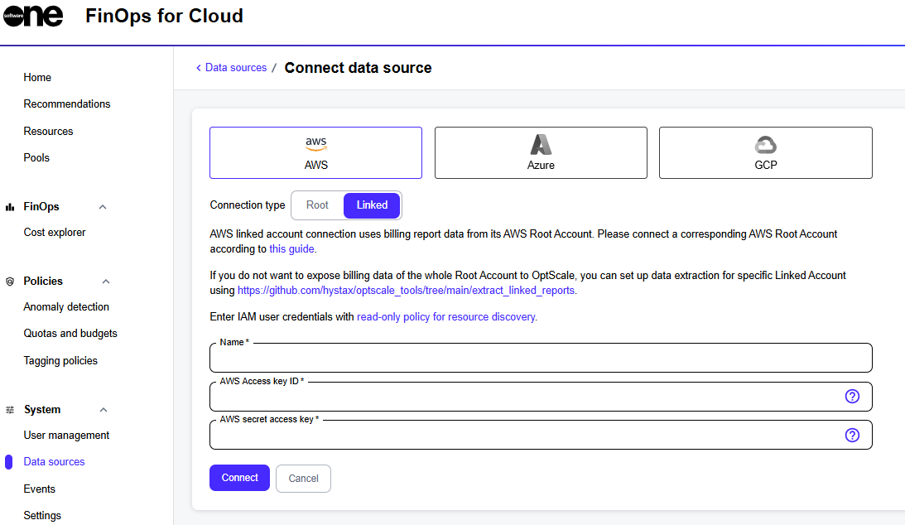
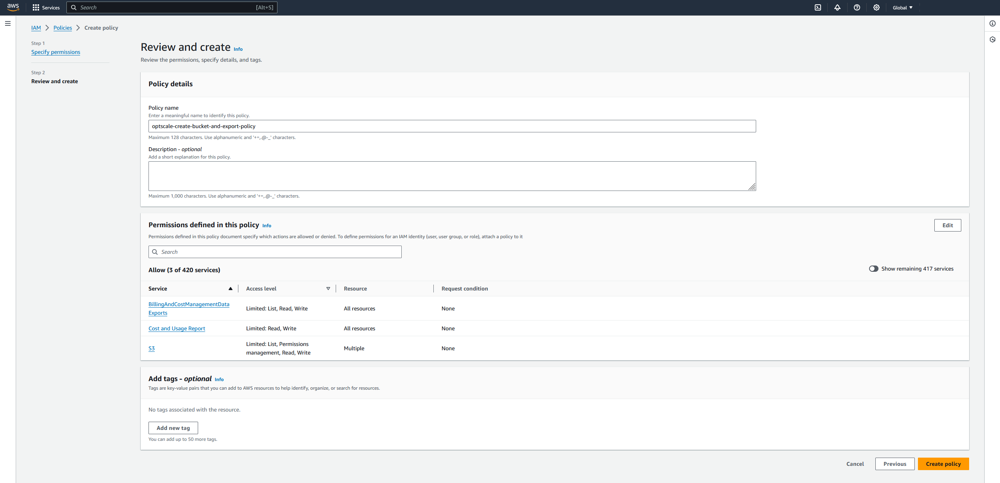

# AWS Root Account With No Data Export Configured

FinOps for Cloud supports the AWS Organizations service that allows linking several Data Sources to centrally manage the data of multiple users while receiving all billing reports within a single invoice.&#x20;

The root account (payer) will be the only one with access to collective data related to cloud spending. When registering this type of profile in FinOps, you'll have the option for Data Exports to be created automatically.


If you connect the root account but don't connect the linked accounts, all expenses from the unconnected linked accounts will be ignored, even if they exist in the data export file. To retrieve expenses from both linked and root accounts, connect all AWS accounts (not just the root). OptScale ignores data from unconnected linked accounts.


To track a new AWS Data Source in your FinOps for Cloud account, select **AWS Root** on the **Connect Data Source** page:

<figure><figcaption></figcaption></figure>

## Creating an automated billing bucket and data export <a href="#automated-billing-bucket-and-data-export-creation-with-optscale" id="automated-billing-bucket-and-data-export-creation-with-optscale"></a>



### Create a user policy for the bucket and export creation access

Go to **Identity and Access Management (IAM)** > **Policies**. Create a new policy for fully automatic configuration (both bucket and export are created) (`<bucket_name>` must be replaced in the policy):

```json
{
    "Version": "2012-10-17",
    "Statement": [
        {
            "Sid": "ReportDefinition",
            "Effect": "Allow",
            "Action": [
                "cur:DescribeReportDefinitions",
                "cur:PutReportDefinition"
            ],
                "Resource": "*"

        },
        {
            "Sid": "CreateCurExportsInDataExports",
            "Effect": "Allow",
            "Action": [
                "bcm-data-exports:ListExports",
                "bcm-data-exports:GetExport",
                "bcm-data-exports:CreateExport"
            ],
            "Resource": "*"
        },
        {
            "Sid": "CreateBucket",
            "Effect": "Allow",
            "Action": [
                "s3:CreateBucket"
            ],
            "Resource": "*"
        },
        {
            "Sid": "GetObject",
            "Effect": "Allow",
            "Action": [
                "s3:GetObject"
            ],
            "Resource": "arn:aws:s3:::<bucket_name>/*"
        },
        {
            "Sid": "BucketOperations",
            "Effect": "Allow",
            "Action": [
                "s3:PutBucketPolicy",
                "s3:ListBucket",
        "s3:GetBucketLocation"
            ],
            "Resource": "arn:aws:s3:::<bucket_name>"
        }
    ]
}
```

<figure><figcaption></figcaption></figure>



### Create the user and grant policies

1. Go to **Identity and Access Management (IAM)** > **Users** to create a new user.&#x20;
2. Attach the created policy to the user.
3. Confirm the creation of the user.
4. Create an access key for the user (**Identity and Access Management (IAM)** > **Users** > **Created user** > **Create access key**).
5. Download or copy Access key and Secret access key. Use these credentials when connecting a Data Source in FinOps as the AWS Access Key ID and AWS Secret Access Key, respectively (at step 3):



### Create a data source in FinOps for Cloud

1. Go to FinOps for Cloud and register as a new user.
2. Sign in as a registered user.
3. Create a Data Source.
   * Provide user credentials (see screenshot for more details):
     * AWS Access key ID
     * AWS Secret access key
   * Select Export type.
   * Select **Create new Data Export**.
   * Provide the parameters with which the bucket and Data Export will be created: **Export Name**, **Export S3 Bucket Name** (\<new bucket name from user policy from step 1>), and **Export path prefix**.&#x20;

<figure><figcaption><p>Connect data source</p></figcaption></figure>

**Note**: Specify the bucket in the **Export S3 Bucket Name** field if it already exists. FinOps for Cloud will then create the report and store it in the bucket using the specified prefix.

After creating the Data Source, wait for AWS to generate the export and upload it to FinOps according to the schedule (approximately one day).



## Discovering resources <a href="#discover-resources" id="discover-resources"></a>

FinOps for Cloud must have permissions configured in AWS for the data source to correctly discover resources and display them under the respective section of the dashboard.

Make sure to include the following policy for FinOps to be able to parse EC2 resource data:

```json
{
    "Version": "2012-10-17",
    "Statement": [
        {
            "Sid": "FinOpsforCloudOperations",
            "Effect": "Allow",
            "Action": [
                "s3:GetBucketPublicAccessBlock",
                "s3:GetBucketPolicyStatus",
                "s3:GetBucketTagging",
                "iam:GetAccessKeyLastUsed",
                "cloudwatch:GetMetricStatistics",
                "s3:GetBucketAcl",
                "ec2:Describe*",
                "s3:ListAllMyBuckets",
                "iam:ListUsers",
                "s3:GetBucketLocation",
                "iam:GetLoginProfile",
                "cur:DescribeReportDefinitions",
                "iam:ListAccessKeys"
            ],
            "Resource": "*"
        }
    ]
}
```

Your AWS Data Source is ready for integration with FinOps for Cloud.

## Creating a data export manually in AWS <a href="#create-data-export-in-aws-manually" id="create-data-export-in-aws-manually"></a>

To utilize automatic or manual billing data import in FinOps, you must create a Data Export in AWS. To learn about Data Exports, see [What is AWS Data Exports?](https://docs.aws.amazon.com/cur/latest/userguide/what-is-data-exports.html)&#x20;

To create a Data Export, navigate to **AWS Billing and Cost Management** > **Data Exports**. Choose **Create Export**.

<details>

<summary>Standard data export settings</summary>

Step 1. Export type

* Select Standard data export export type.

Step 2. Export name

* Enter the export name.

Step 3. Data table content settings:

1. Select **CUR 2.0**.
2. Select **Include resource IDs** checkbox.
3. Choose the time granularity for how you want the line items in the export to be aggregated.

Step 4. Data export delivery options:

1. Select **Overwrite existing data export file**.
2. Select compression type.

Step 5. Data export storage setting:

1. Create a new or use an existing bucket for the export.
2. Enter the S3 path prefix that you want prepended to the name of your Data Export.

Step 6. Review

* Confirm export creation. AWS will prepare Data Export within 24 hours.

</details>

<details>

<summary>Legacy CUR export settings</summary>

Step 1. Export type

* Select **Legacy CUR export (CUR)** export type.

Step 2. Export name

* Enter export name.

Step 3. Export content

* Select **Include resource IDs** and **Refresh automatically** checkboxes.

Step 4. Data export delivery options:

1. Choose the time granularity for how you want the line items in the export to be aggregated.
2. Select **Overwrite existing report**.
3. Select compression type.

Step 5: Data export storage setting:

1. Create a new or use an existing bucket for the export.
2. Enter the S3 path prefix that you want prepended to the name of your Data Export.

Step 6. Review

* Confirm export creation. Data Export will be prepared by AWS within 24 hours.

</details>

After the data export is created, follow the instructions in [AWS Root Account with Data Export Already Configured.](aws-root-account-with-data-export-already-configured.md)
