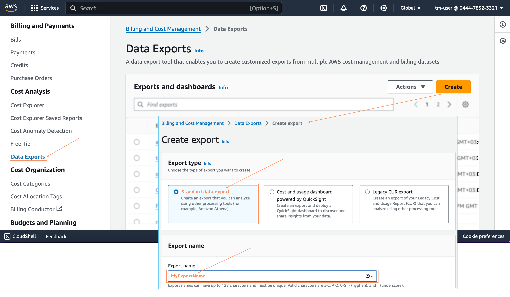
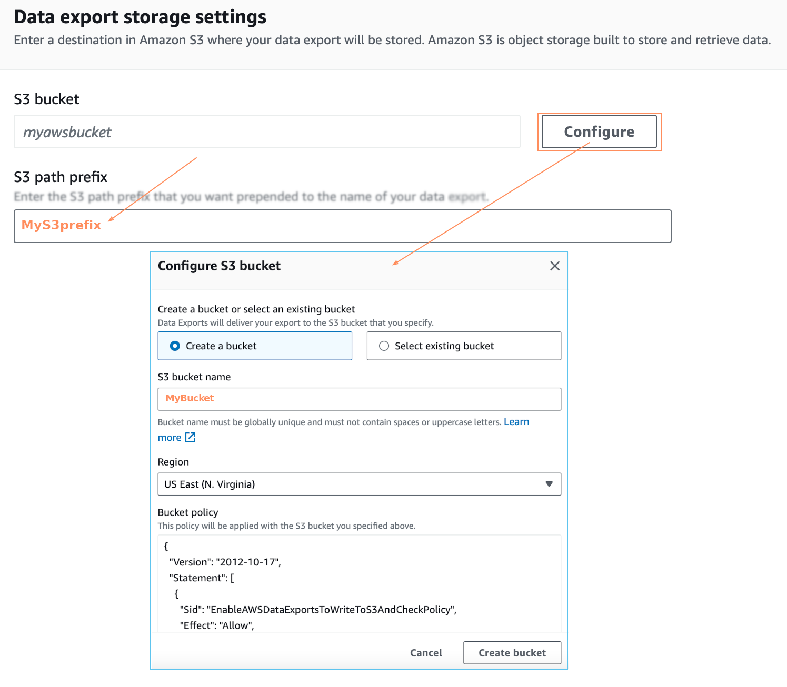
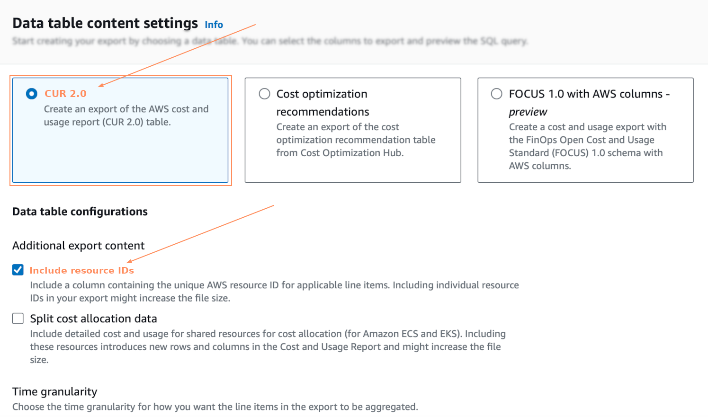
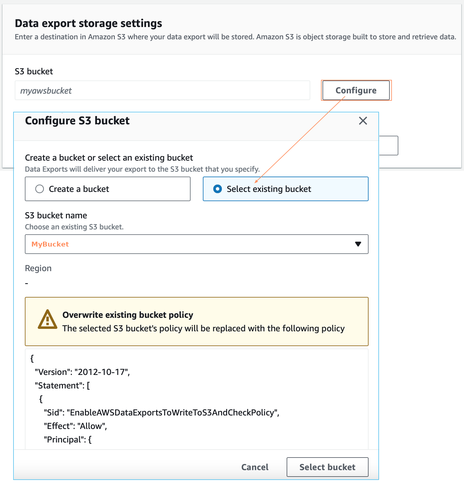
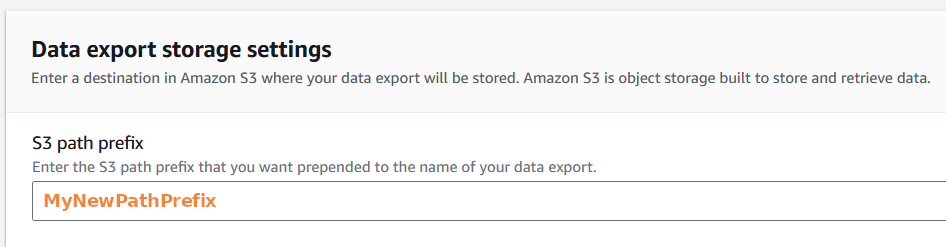

# Migrate from CUR to Data Exports CUR 2.0

Follow this page if an AWS Data Source (Legacy CUR export schema) has already been connected and you want to configure CUR 2.0 data and update the AWS Data Source.

## Migrating CUR to CUR 2.0 (using a new bucket) 

To create a new Data Export with CUR 2.0 schema:

1. Navigate to the **Data Exports** page in AWS Billing and Cost Management.
2. Select **Create** and then select **Standard data export** export type.
3. Enter the export name. The name is required when updating an AWS Data Source in FinOps for Cloud.

<figure><figcaption>
Create export
</figcaption></figure>

4. In **Data table content settings**, do the following:
   1. Select **CUR 2.0**.
   2. Select the **Include resource IDs** checkbox.
   3. Choose the time granularity for how you want the line items in the export to be aggregated.

<figure><figcaption>
Data table content settings
</figcaption></figure>

5. In **Data export delivery options**, select **Overwrite existing data export file**. Select the compression type.
6. In **Data export storage settings**, configure a new bucket. You'll need to provide the **S3 path prefix** and **S3 bucket name** when updating an AWS Data Source in FinOps.

<figure><figcaption>
Configure S3 bucket
</figcaption></figure>

7. Confirm export creation. AWS will prepare Data Export within 24 hours.
8. Select the existing AWS Data Source on the Data Source page in FinOps for Cloud. The page with detailed information opens.&#x20;
9. Select **Update credentials** to update the Data Source credentials.&#x20;
10. In **Update AWS Cloud credentials**, do the following:
    1. Enable **Update Data Export parameter**_s_ to update information about the billing bucket.
    2. Select the **Standard data export (CUR 2.0)** export type.&#x20;
    3. Enter the **Export name** from the first step, the **S3 bucket name** as Export Amazon S3 bucket name, and the **S3 bucket name** as Export path prefix.
    4. Save the changes and wait for a new export to import.

## Migrating CUR to CUR 2.0 (using an existing bucket)

Use this case if you have already connected an AWS Data Source (on Legacy CUR export schema) and want to configure CUR 2.0 data into the same bucket.

1. Navigate to the **Data Exports** page in AWS Billing and Cost Management.
2. Select **Create** and then select **Standard data export** export type.
3. Enter the export name. The name is required when updating an AWS Data Source in FinOps for Cloud.
4. In **Data table content settings**, do the following:
   1. Select **CUR 2.0**.
   2. Select the **Include resource IDs** checkbox.
   3. Choose the time granularity for how you want the line items in the export to be aggregated.

<figure><figcaption>
<strong>Data ta</strong>ble content settings
</figcaption></figure>

5. In **Data export delivery options**, select **Overwrite existing data export file.** Select compression type.
6. In **Data export storage settings**, select **Configure** and then select **Select existing bucket**.

<figure><figcaption>
<strong>Data</strong> export storage settings
</figcaption></figure>

7. Enter the new **S3 path prefix**.

<figure><figcaption>
Path prefix
</figcaption></figure>

8. Select the existing AWS Data Source on the Data Source page in FinOps for Cloud. The page with detailed information opens.
9. Click **Update credentials** to update the Data Source credentials.&#x20;
10. In **Update AWS cloud credentials**, do the following:
    1. Enable **Update Data Export parameters** to update the billing bucket information.
    2. Select **Standard data export (CUR 2.0)** and update the **Export name** and **Export path prefix.**
    3. Save the changes and wait for a new export to import.
