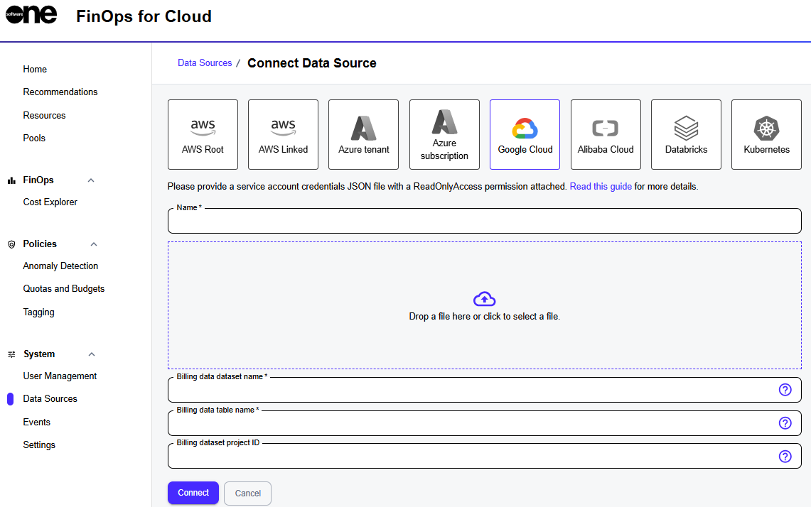

# Google Cloud Platform

This topic describes how to connect your Google Cloud Platform (GCP) account to SoftwareOne's FinOps for Cloud. When connecting your account, you will need to provide the billing data details, such as the dataset name and table name.&#x20;

<figure><figcaption><p>Google Cloud data source</p></figcaption></figure>

## Enabling billing export <a href="#enable-billing-export" id="enable-billing-export"></a>

To enable billing data export, see [Set up Cloud Billing data export to BigQuery](https://cloud.google.com/billing/docs/how-to/export-data-bigquery-setup) in the Google documentation.

After you have enabled billing data export, a new table is displayed in your BigQuery project.&#x20;

Note the names of the dataset and the table. You'll need these details when connecting your cloud account to FinOps for Cloud.

<figure><figcaption><p>Billing export</p></figcaption></figure>

## Creating a role for FinOps for Cloud <a href="#prepare-a-role-for-optscale" id="prepare-a-role-for-optscale"></a>

You can create a role using Google Cloud CLI or Google Cloud Console:



To assign the role via [gcloud CLI](https://cloud.google.com/sdk/gcloud), run the following command:

```
gcloud iam roles create
optscale_connection_role \--project=hystaxcom
\--permissions=bigquery.jobs.create, bigquery.tables.getData, compute.addresses.list, 
compute.addresses.setLabels, compute.disks.list, compute.disks.setLabels, compute.firewalls.list, 
compute.instances.list, compute.instances.setLabels, compute.images.list, compute.images.setLabels,
compute.machineTypes.get, compute.machineTypes.list, compute.networks.list, compute.regions.list, 
compute.snapshots.list, compute.snapshots.setLabels, compute.zones.list, iam.serviceAccounts.list,
monitoring.timeSeries.list, storage.buckets.get, storage.buckets.getIamPolicy, storage.buckets.list, 
storage.buckets.update
```



1. Sign in to the [Google Cloud console](https://console.cloud.google.com/welcome).
2. In the Search bar, enter **Roles**, and then on the [Roles page](https://console.cloud.google.com/iam-admin/roles), click **Create Role**.&#x20;
3. Provide the role title and description.
4. Click **Add permissions** and add the following permissions to the created role:
   * bigquery.jobs.create
   * bigquery.tables.getData
   * compute.addresses.list
   * compute.addresses.setLabels
   * compute.disks.list
   * compute.disks.setLabels
   * compute.firewalls.list
   * compute.instances.list
   * compute.instances.setLabels
   * compute.images.list
   * compute.images.setLabels
   * compute.machineTypes.get
   * compute.machineTypes.list
   * compute.networks.list
   * compute.regions.list
   * compute.snapshots.list
   * compute.snapshots.setLabels
   * compute.zones.list
   * iam.serviceAccounts.list
   * monitoring.timeSeries.list
   * storage.buckets.get
   * storage.buckets.getIamPolicy
   * storage.buckets.list
   * storage.buckets.update
5. Click **Add**.
6. Click **Create**.



## Creating a service account <a href="#create-service-account" id="create-service-account"></a>

Learn about service accounts in the Google documentation - [Service accounts | IAM Documentation | Google Cloud](https://cloud.google.com/iam/docs/service-accounts).&#x20;

To create a service account:

1. From your GCP console, select [Service Accounts ](https://console.cloud.google.com/iam-admin/serviceaccounts)in the left-hand menu and click **Create Service Account**.
2. Enter a service account name and optionally, enter a description of the service account.
3. Select **Create and continue**.
4. Select the [role you created](google-cloud-platform.md#prepare-a-role-for-optscale) and click **Continue**.
5. Select **Done**.

## Generating an API key for your service account <a href="#generate-api-key-for-your-service-account" id="generate-api-key-for-your-service-account"></a>

To generate an API key for your service account:

1. Find your service account in the service accounts list and click its name to go to the service account details page.
2. Go to the **Keys** tab.
3. Select **Add key** > **Create new key**.&#x20;

The service account API key will be downloaded as a JSON file. Use this file when connecting your cloud account to FinOps.

## Connecting the data source in FinOps for Cloud <a href="#connect-data-source-in-optscale" id="connect-data-source-in-optscale"></a>

Use the newly downloaded service account credentials JSON file with the billing dataset details to connect your GCP cloud account. Next, click **Connect** to complete the setup.

<figure><figcaption><p>Google Cloud data source</p></figcaption></figure>
