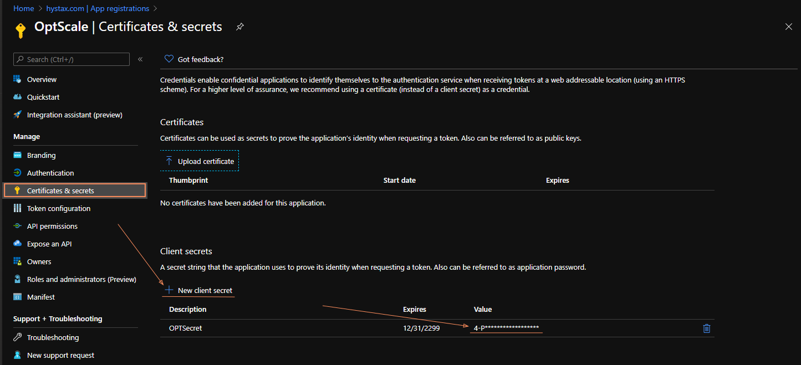

# Microsoft Azure

To track a new Azure Data Source in your FinOps for Cloud account, select **Azure subscription** on the **Connect Data Source** page.

<figure><figcaption>
Azure subscription option
</figcaption></figure>

1. **Name** - Specify the preferred name for this Data Source.
2. **Directory (tenant) ID** - Directory (tenant) ID is a globally unique identifier (GUID) that is different from your organization name or domain. Its value is available in the overview of the application, added via **App registrations**. To find the value, go to Home > App registrations > e.g. _OptScale_ > Overview > Directory (tenant) ID.

<figure><figcaption></figcaption></figure>

3. **Subscription ID** - Enter the subscription ID. A subscription ID is a unique string that identifies your Azure subscription. You can find the ID in the [Microsoft Azure Portal](https://portal.azure.com/).&#x20;
   1. To find the ID, search for **Subscriptions** in Azure. You'll see a list of all subscriptions associated with your Azure account. The list will include a subscription ID for each subscription. When FinOps for Cloud is programmatically signing in to Azure, it needs to pass a tenant ID and an application ID along with a secret, which is the authentication key.
4. **Application (client) ID** - This ID must be generated manually in Azure to allow API communication with FinOps. To generate the ID:
   1. In Microsoft Entra ID (formerly Azure Active Directory), navigate to **App registrations**.
   2. Select **+ New registration** and provide a name, for example, Optscale, and then click **Register**. The new Application ID becomes available.

<figure><figcaption></figcaption></figure>


After registering the application, you must explicitly grant it permissions in the form of a _Role assignment_ to work with the current Azure subscription.


5. **Secret** - A secret must be created within the newly registered application. To create a secret:
   1. Go to the **App registrations** and click on your application, for example, OptScale.&#x20;
   2. Select **Certificates & Secrets** in the left navigation bar and click **+ New client secret**.&#x20;

<figure><figcaption></figcaption></figure>


The secret's value is hidden shortly after its creation. Make sure to copy the value.


Once the required fields are filled out, click **Connect** to validate the information. Once you have connected to the account, the data will be pulled from the source shortly afterward and become available on the page.&#x20;

## Performing a role assignment

To perform a role assignment:

1. Sign in to the Azure Portal and navigate to **Subscriptions**.
2. Select the subscription you have provisioned to be linked to FinOps. You'll be directed to its dashboard.&#x20;
3. Select **Access control (IAM)** in the left navigation and then go the **Role assignments** tab and click **+Add** > **Add role assignment**.

<figure><figcaption></figcaption></figure>

4. In **Add role assignment**, complete the following steps:
   1. On the **Role** tab, select **Reader** and click **Next**.
   2. On the **Members** tab, make sure that **User, group, or service principal** is selected. Click **Next.**
   3. The third field should contain the name of a registered application from the previous steps, for example, _FinOps_. Click **Next.**
   4. On the **Review + assign** tab, review the role assignment settings and click **Review + assign** to assign the role.
