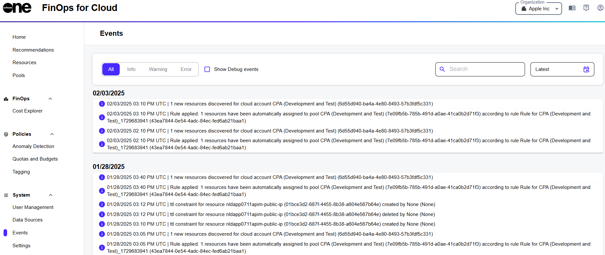

# Events

The **Events** page is a read-only page that displays all events that have occurred within your account. You can access this page from the sidebar.&#x20;

<figure><figcaption>
Events page
</figcaption></figure>

The list of events includes events that are initiated by a user as well as the system. The data on this page is continuously updated, allowing you to monitor and track events in real time.&#x20;

Examples of events include:

* Discovery of new resources for cloud accounts.
* Automatic assignment of resources to a pool.
* Invitations that were sent to new account members.

By default, all events are listed on the page, but you can filter them by categories, such as Information, Warning, and Error.

For each event, you can view additional details by selecting the event. Additional details include the date and time when the event occurred, a brief description, and the name and type of object on which the event occurred.&#x20;

You can also search for specific events by entering the search criteria in the **Search** field. Selecting the Date icon lets you select a date and sort the list of events in the table.
