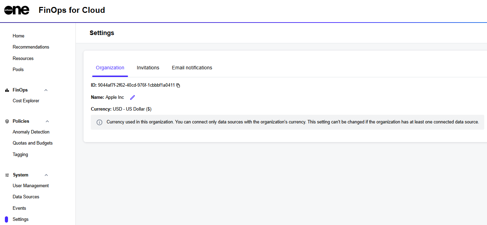

# Settings

The **Settings** page in FinOps for Cloud lets you view and manage your organization settings, account invitations, and email notifications.

You can access the page from the sidebar.

<figure><figcaption>
Settings page
</figcaption></figure>

The **Settings** page contains the following tabs:

* **Organization** - From this tab, you can copy your organization ID and edit your organization name. The tab also displays the currency used in this organization. You can connect only data sources with the organization's currency. This setting can't be changed if the organization has at least one connected data source.
* **Invitations** - Use this tab to view all pending invitations for the account.
* **Email notifications** - Use this tab to manage the notification emails for your account. The tab displays all functionalities for which you can receive alerts. Use the slider to adjust your preferences.
