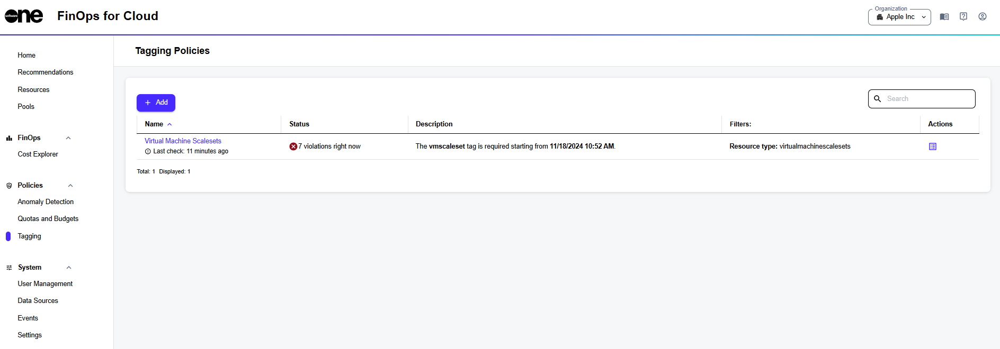

# Tagging

The **Tagging Policies** page allows you to view and manage your tagging policies.&#x20;

This page helps ensure that your resources are properly categorized and monitored according to the organization's standards.

## Tagging interface

In FinOps for Cloud, you can access the **Tagging Policies** page from the sidebar. On this page, you can see all policies along with their status, and [create a new tagging policy](create-tagging-policies.md).

<figure><figcaption>
Tagging in FinOps for Cloud
</figcaption></figure>

The page contains the following options:

* **Name** - Displays the name of the tagging policy.&#x20;
* **Status** - Provides information about the policy's status, including any violations, and helps understand if any resources are not complying with the tagging policy.
* **Description** - Displays a short description of what the policy monitors.
* **Filters** - Lists the filters that were used to define or create the policy.
* **Actions** - Contains the **Show resources** option. Clicking this option opens the **Resources** page, where you can view all the resources within the tagging policy.&#x20;
