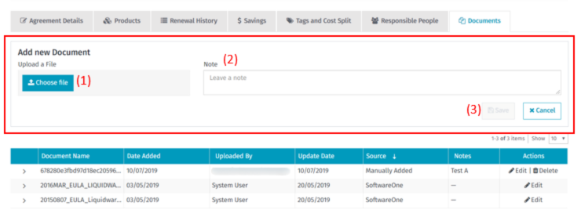

# Renewal manager

Renewal Manager lets you collect, track, and manage contractual and software maintenance renewals independent of the software license supplier or distribution channel.

When you log into Renewal Manager for the first time, the application will set up a session for you. It will retrieve all the information from your agreements purchased through SoftwareOne. This may take several seconds, depending on the data volume.

## Summary Page 

The Renewal Manager Summary Page includes an advanced search feature that allows you to narrow down the agreements displayed in the tiles. Search filters help you focus on the aggregated data that is most relevant to you.

The page also contains:

* **Agreements**, **Costs**, **Savings Analysis**, and **Products Overview** tabs.
* **Past Period**, **Today’s tasks**, and **Ending period** tiles with aggregated data.
  * **Past Period** – shows information relating to agreements that have ended within the selected period. By selecting the preferred period from the dropdown, you can customize the summary page.
  * **Today’s Tasks** – highlights tasks that should be addressed quickly.
    * **Renewals Overdue** – Agreements that have passed their renewal date and the renewal process is not yet completed.
    * **Agreements Added** – Newly added Agreements
    * **Add Agreements Manually**
  * **Future Period** – shows aggregated data from future periods you select from the dropdown.

The links in the tiles take you to the list of agreements with filters applied. This allows you to see the full list of agreements aggregated into the tiles.

<figure><figcaption></figcaption></figure>

#### Add Agreements Manually 

Renewal Manager is not limited to agreements and software purchased through SoftwareOne.

The **Add Agreements Manually** option lets you add agreements to Renewal Manager that have not been purchased through SoftwareOne.

After entering the data, select **Save**. You will then see the Agreement Details Page for the agreement you have just created. After registering an agreement, you can add product and cost information to this agreement as a second step.

<figure><figcaption>
Add a new agreement and save your changes.
</figcaption></figure>

## Agreements Tab 

On the Agreements tab, you can:

* Define filters for advanced search.
* See a list of all agreements, including customization functions.
* Select multiple bulk actions to be carried out.

The Agreements list shows all agreements either purchased through SoftwareOne, imported from Entitlement Manager, or registered manually.

All agreements are divided into 4 groups (sub-tabs are visible above the agreements list).

* **Agreements** – Shows agreements with a defined end date. This means that for those agreements, it is necessary to define a certain date in the future when the agreement must be renewed or terminated.
* **Evergreen Agreements** – Shows agreements that don't have an end date. For example, Transactional License Agreements for perpetual licenses without any maintenance. Master Agreements, like Microsoft MPSA or Adobe VIP Agreements, are also listed.
* **Archive** – Shows archived agreements. You can archive agreements if they are set to **Renewed** or **Terminated**. If the renewal process for an agreement is currently **in progress**, you cannot archive it. You can archive single agreements by using the “action” available in the grid view. If you want to archive multiple agreements in one go, use the bulk action option.
* **Under Maintenance** – Shows new agreements purchased through SoftwareOne, and agreements imported from Entitlement Manager, which are missing data and cannot be managed by Renewal Manager.
  * If there are no incomplete agreements existing, this sub-tab won’t be visible.
  * You can request that the data be completed by selecting **Update** in the column of a specific agreement. You can also use the **Notes** section to add further information before submitting the request.
  * Once submitted, the agreement for which the update has been requested is marked as **Updating**, and the **Update** button is no longer available. After the agreements are updated, they are listed on the **Agreements** or **Evergreen Agreements** tabs.

#### Advanced Search 

Advanced search allows you to narrow down the list of agreements. The various filter options allow you to display the agreements that are of interest to you.

**Save Search**

In case you are using the same filter combination on a regular basis, you can save it as a favorite with ‘Save Search’.

#### Bulk Actions 

Bulk actions simplify administrative tasks by allowing you to modify multiple agreements in a single action.

When you select one or more checkboxes in the agreements list, the **Actions** button becomes enabled. You can then choose from the following actions:

<table><thead><tr><th width="247">Action</th><th>Description</th></tr></thead><tbody><tr><td><strong>Archive</strong></td><td>
Archive selected agreements. Archived agreements are moved to the <strong>Archive</strong> subtab.

Only agreements with a Renewal Progress status of <strong>Renewed</strong> or <strong>Terminated</strong> can be archived. Agreements that are still undergoing the renewal process cannot be archived until the process is complete.

</td></tr><tr><td><strong>Change currency</strong></td><td>Change the currency for all selected agreements. By changing the currency, the total costs of the agreement are exchanged into the selected currency using the current exchange rates from today. Selecting the same currency for all agreements makes it easier to compare and run analyses.</td></tr><tr><td><strong>Add tags</strong></td><td>Add specific tags for all selected agreements. See more details in Tags and Cost Split.</td></tr><tr><td><strong>Remove tags</strong></td><td>Remove specific tags from all selected agreements. This is only available when you select agreements with tags.</td></tr><tr><td><strong>Add responsible people</strong></td><td>Add the person who is responsible for the selected agreement.</td></tr><tr><td><strong>Remove responsible people</strong></td><td>Remove the responsible person from the selected agreement.</td></tr></tbody></table>

### Agreement Details Page 

The Agreement Details page shows all data stored for specific agreements. From this view, you can use the various tabs to manage agreement data.

#### Agreement Details Page Header 

Regardless of which tab you are viewing on the Agreement Details page, the upper section of the page remains the same.

* With the **Navigation Tile**, you can always switch back to one of the main tabs, such as the list of agreements.
* The **Summary Tile** provides an overview of the agreement’s total cost:
  * **Paid Cost** – The total cost of all transactions associated with this agreement to date.
  * **Estimated Renewal Cost** – The automatically calculated renewal cost is based on the paid cost, license type, and license period.
* The **Renewal Progress Tile** displays the latest renewal status. For more details about the renewal progress, you can also refer to the **Renewal History** tab.
* The **Renewal Progress** message includes links to the latest documents, such as the Quote, Order, and Invoice.

Switch between the different tabs to view all available data. Depending on your permissions, some tabs may not be visible.

#### Estimated Renewal Cost Calculation 

The Estimated Renewal Costs are calculated using this formula: Current Cost × Renewal Factor ÷ Current Period × Renewal Period.

**Calculation Parameters**:

* **Current Cost:** Paid cost of the initial transaction.
* **Renewal Factor:** Percentage applied based on the license type:
  * **License & Maintenance:** 20%
  * **Maintenance:** 100%
  * **Subscription:** 100%
  * **Support:** 100%
  * **Services:** 0%
  * **License:** 0%
* **Current Period:** License period of the initial transaction.
* **Renewal Period:** License period of the renewal.

**Calculation Example**:

* **License Type:** License & Maintenance
* **Renewal Factor:** 20%
* **Current Cost:** 5,000.00
* **Current Period:** 01 Jan 2019 – 31 Dec 2019
* **Renewal Period:** 01 Jan 2020 – 31 Dec 2020

**Calculation:**

5,000.00 × 20% ÷ 365 days × 365 days = 1,000.00

### Agreement Details Tab 

The Agreement Details Tab provides you with agreement descriptions, categorizations, and dates. For example, Contract Numbers, Agreement Owner, publisher, End Date, Anniversary Date, and much more.

#### Edit Agreement

Selecting **Edit** on the Agreement Details tab opens the **Edit** view.

When editing an agreement, the available options depend on the agreement source:

* **Registered manually** – You can update all fields related to the agreement.
* **Imported from the SoftwareOne ERP System or Entitlement Manager** – You can only update fields that were not imported from these systems. Fields that are disabled cannot be edited. However, you can request an update by selecting **Request an Update**.

#### Request an Update

To change an uneditable field of an agreement purchased through SoftwareOne or imported from Entitlement Manager, you can request an update.

### Products Tab 

When agreements have related products, a list of all related products is displayed on the **Products** tab.

For agreements purchased through SoftwareOne or agreements imported automatically from Entitlement Manager, the related products are displayed automatically.

#### Product Details View

To see more details for a specific product in the list, select the row with the product or select **View** in the **Actions** column.

In the **Details** view, you can see all data relating to the product. From this view, you can also:

* Edit product data.
* Delete products (applies only to products added manually).

#### Editing Product Data

The **Edit** feature distinguishes between imported and manually created products. For imported products, only certain fields can be edited.

When you change the **Start Date** or **End Date** in the **Product Details** view, a notification is displayed informing you that this action may remove data entered in the payment table.

The payment table is updated based on the new number of payments. Changing the **Start Date** or **End Date** of an agreement in the **Edit agreement** view can also trigger changes to the payment plans of products associated with that agreement.

#### Adding Products

Within each agreement, you can manually allocate additional products.

Adding a product manually is a two-step process:

* Complete the **Product Details** on the first page.
* Complete the **Payment Details** on the second page.

Fields marked with an asterisk (\*) are mandatory. All required fields must be completed before you can proceed to the **Payment Details** page.

* The **Agreement Period** dates are inherited from the agreement by default. You can manually enter different dates if required.
* The **Payment Plan Type** options (**Upfront**, **Monthly**, **Annual**) determine the **Number of Payments** based on the agreement period dates. Selecting a payment plan type displays a table with one row per payment, where you can enter the quantity and cost for each payment.

When a custom renewal period is set, the number of renewal payments is updated accordingly.

### Renewal History Tab 

The **Renewal History** Tab shows renewal activity of the currently selected agreement and the connections to other agreements if they exist.

The **Renewal Progress** tile and the message in the upper section of the agreement details page give you the latest renewal activity status.

#### Renewal Activity

This section displays all renewal activities for the currently selected agreement. It starts from the **Quote in Progress** until the renewal is renewed.

If the agreement was transacted through SoftwareOne, the **Renewal Progress Status** is linked with SoftwareOne’s internal Renewal Process and is updated automatically.

The related Sales Documents (such as Quotes, Orders) can be accessed directly from this view.

#### Add New Update

For agreements not purchased through SoftwareOne, you can update the status manually.

For manually registered agreements or agreements imported from Entitlement Manager, you can select a Renewal Progress Status and add optional notes.

#### Agreement Renewal History

This section shows the history of agreements.

If agreements co-terminate or renew into another agreement, those agreements are collated and are displayed in the Agreement Renewal History section.

### Savings Tab 

On the **Savings** tab, you can add savings relating to a specific agreement.

The **Total Savings** tile shows the savings sum for the agreement. In the **Date of Savings** field, you can enter the date you want for your [Savings Analysis](renewal-manager.md#post-796-_toc14239659). By default, this is set to the agreement start date.

### Tags and Cost Split Tab 

This feature lets you select or create tags related to the agreement and allocate the cost split percentage.

All tags added to the agreement are visible in the list on the **Tags and Cost Split** tab.

The tag list is available on the **Agreements** Tab. If you don’t see the tags column, you can customize grids in Renewal Manager. If you hover over a specific tag, a tooltip with more details appears.

### Responsible People Tab 

In this section, you can add people responsible for an agreement by selecting **Add Contact**.

Contacts from agreements that have the same agreement owner can be shared between multiple agreements.

For agreements purchased through SoftwareOne, a contact is automatically created. This contact is the salesperson responsible for that agreement. This contact cannot be edited or deleted.

### Documents Tab 

In this section, you can view a list of documents related to the agreement and add new documents.

Documents synchronized with an external system cannot be deleted; they can only be edited. Documents added manually can be both edited and deleted.

#### Adding a new document

When you select **Add New Document**, the form opens.

From here, you can upload a file and add a note to describe it. Select **Save** to save the file in the **Documents** section.

<figure><figcaption>
Choose the file to upload, add notes, and save your changes.
</figcaption></figure>

## Costs 

Within the Costs tab, you can use a Bar Chart and a Gantt Chart to analyze costs.

The **Bar Chart** displays costs over time, with the option to switch between views, including **Month**, **Quarter**, or **Year**. You can also navigate backward and forward within the chart.

Use the **Cost By** drop-down menu to switch to a stacked bar chart and group costs by:

* Agreements
* Publisher
* Cost Type (Paid, Still to Pay, Renewal Costs)
* Tag

Selecting a stacked bar allows you to drill down into the selected data. Selecting a drilled-down bar opens a list below the chart, such as a list of related agreements.

#### Gantt Chart

The **Gantt Chart** displays a list of agreements with a visual representation of each agreement’s timeline, including the active period and renewal period.

Hover over a bar to view additional details about the corresponding agreement.

Click on a bar to open the **Agreement Details** page for that agreement.

Filter options are also available above the chart to help you refine the displayed data.

## Savings Analysis 

Savings Analysis displays a summary of your savings for all agreements. The savings data is for the defined “Start – End” date period.

## Products Overview 

The Products Overview tab shows a list of all products in Renewal Manager, regardless of the agreement.

Within this list of products, you can:

* Use advanced search to narrow down the number of products displayed.
* Customize the list by sorting and grouping displayed elements.
* View more product details by clicking on the product name.

## User Role – Read Only Access 

You can assign read-only user access.

Read-only access allows users to view the list of agreements and related data but prevents them from making any changes, including:

* Adding or editing agreements.
* Adding or editing products.
* Executing bulk actions.
* Modifying any data.

## Grid Customization 

Each grid available in Renewal Manager can be personalized.

When you select **Customize**, a list of available columns is displayed. Select the checkboxes next to the information you want to add to the grid.

<figure><figcaption>
Customize the columns in the grid.
</figcaption></figure>

If you select multiple columns to display and the view is not wide enough to show all information, you can resize the specific column widths by moving your mouse cursor over the column border and then “click and drag” the column to your required width.

Use the horizontal scroll bar to navigate across.

<figure><figcaption>
Use the column header to resize width.
</figcaption></figure>

## Exports 

You can generate reports from Agreements, Products, and Payments.

To do this, select **Export** and select the relevant export list. To view generated reports, select **Go to My Reports**.

<figure><figcaption>
Use the <strong>Exports</strong> option to generate reports.
</figcaption></figure>

## Notifications 

The Alert icon on the top right of the page shows the number of recent notifications. Once clicked, a list of notifications opens, which shows the notification details.

To manage Renewal Manager Notifications, select **Manage**. This will open up the Notification Hub Manager, where you can manage your notifications.
