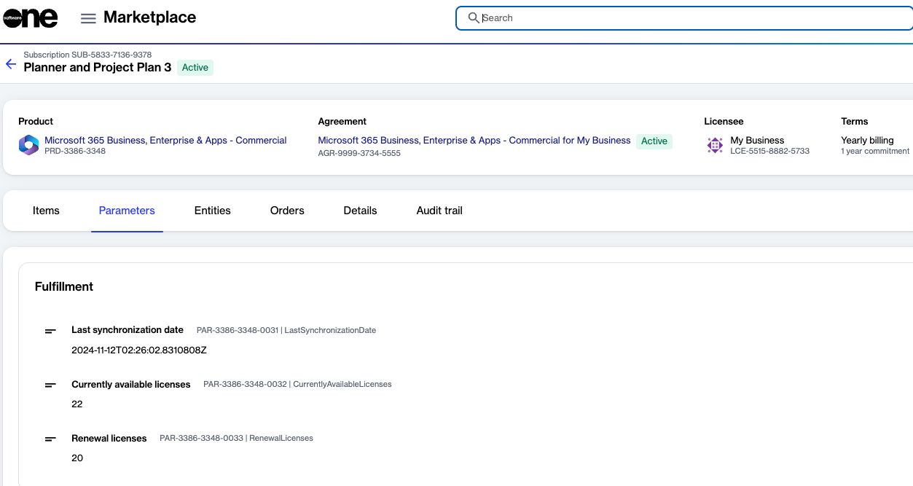

# How do I reduce licenses in a subscription

You can reduce licenses by editing the subscription directly. For detailed instructions, see [How to increase or reduce licenses](../../../../marketplace-platform/guides-and-tutorials/marketplace-for-clients/adjust-subscription-quantity.md).

If the seat reduction is done within 7 days of ordering, the changes are applied in the Marketplace Platform and Microsoft.

However, if the reduction occurs outside the 7-day window, the changes are scheduled on the Microsoft side and are applied subsequently in the Marketplace.&#x20;

To view your currently available licenses and the licenses scheduled for renewal, see the **Parameters** tab on the subscription details page.

<figure><figcaption>
Use the Parameters tab on the subscription details page to view license count.
</figcaption></figure>

