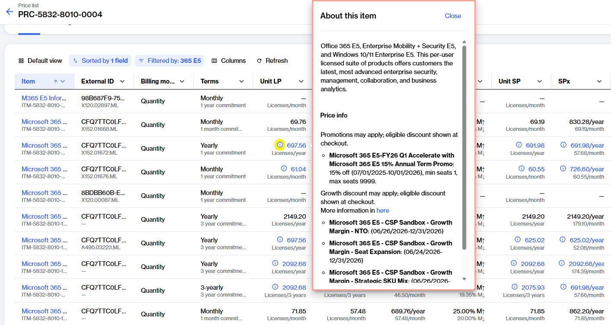

---
layout:
  width: default
  title:
    visible: true
  description:
    visible: true
  tableOfContents:
    visible: true
  outline:
    visible: true
  pagination:
    visible: true
  metadata:
    visible: true
  tags:
    visible: false
  actions:
    visible: true
  anchors:
    visible: true
tags:
  - tag: new
    primary: true
---

# How do CSP price benefits work?

Some Microsoft Cloud Solution Provider subscriptions may qualify for reduced pricing through either Microsoft NCE promotions or SoftwareOne growth discounts.

### Microsoft NCE promotions

Microsoft promotions are time-limited discounts offered on selected products and subscriptions, including Microsoft 365, Dynamics 365, Windows 365, and other Microsoft services.&#x20;

These promotions offer reduced pricing for eligible purchases and are designed to support the adoption of new products, upgrades, or longer-term subscription commitments.&#x20;

Promotions are defined and funded by Microsoft and are applied automatically when all eligibility requirements are met. Each promotion has its own terms and conditions, which may vary by product, region, customer segment, subscription term, or license quantity.

Eligibility depends on the specific promotion and may be based on factors such as:

* Promotion validity dates&#x20;
* Customer eligibility
* Minimum or maximum license quantities
* Subscription commitment term
* Cancellation policy
* Renewal pricing

To learn how NCE promotional discounts are displayed in SoftwareOne Marketplace, see [NCE Promotion Details Now Available in Price Lists](../release-notes.md#nce-promotion-details-now-available-in-price-lists).

### SoftwareOne growth discounts

SoftwareOne passes through certain Microsoft partner growth incentives as discounted pricing for eligible subscriptions. These discounts are available only when specific Microsoft eligibility criteria are met, and are applied automatically during creation.

Growth discounts are typically available in the following categories:

<table><thead><tr><th width="205">Type</th><th>Description</th></tr></thead><tbody><tr><td>New-to-Offer (NTO</td><td>Applies when the customer has not owned the product within the defined look-back period and meets the minimum seat requirements.</td></tr><tr><td>Seat Expansion</td><td>Applies when an existing subscription experiences significant license growth and meets Microsoft's expansion thresholds.</td></tr><tr><td>Strategic SKU Mix</td><td>Applies when qualifying strategic products meet the required seat count and ratio thresholds.</td></tr></tbody></table>

In the SoftwareOne Marketplace, you can identify growth discounts in the same way as NCE promotions.&#x20;

Growth discount information is displayed during the ordering process. Additionally, eligible items display an information icon (<i class="fa-circle-info">:circle-info:</i>) in the price list. Select the icon to view growth discount details and eligibility information.

<figure><figcaption>
Select the info icon to view growth discount details.
</figcaption></figure>


For new CSP customers, eligibility cannot always be verified before the subscription is provisioned. If a promotion or growth discount is identified after provisioning, the subscription price is automatically updated in the SoftwareOne Marketplace to reflect the applicable discount.

