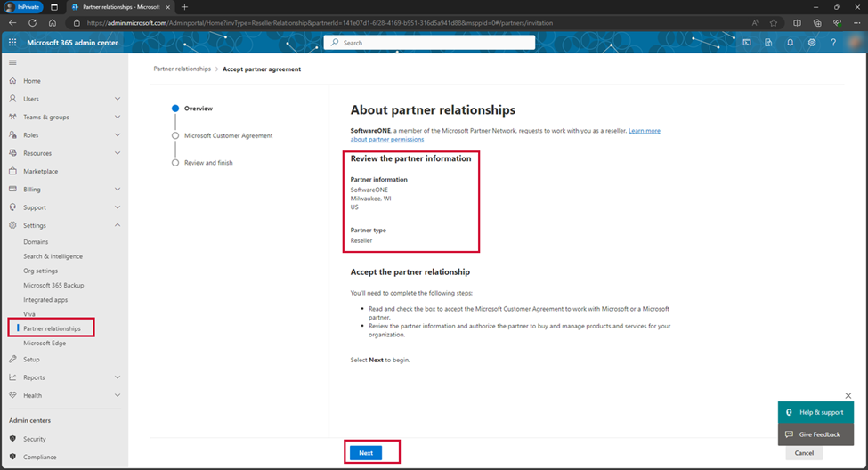
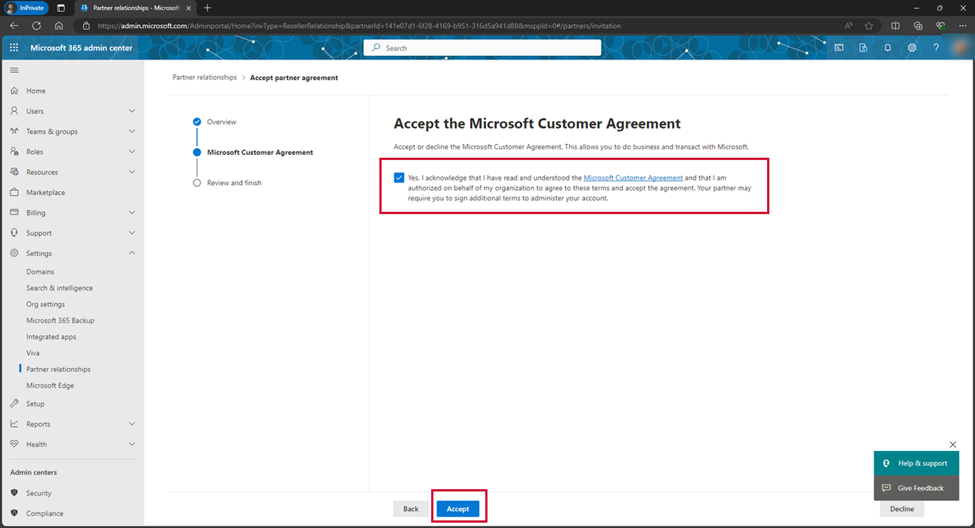
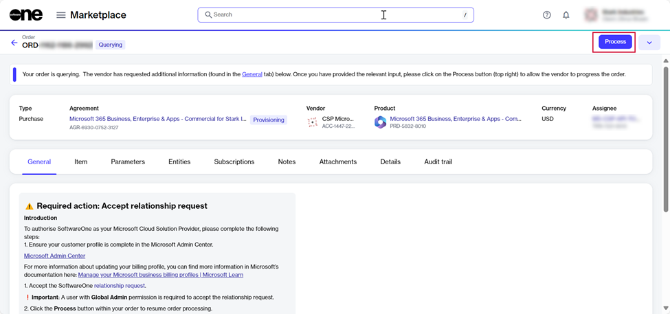

# How to establish a partner relationship with SoftwareOne

To ensure seamless management of your Microsoft 365, Dynamics 365, and Azure subscriptions, you must establish a partner relationship with SoftwareOne.&#x20;

This allows SoftwareOne to fulfill your Microsoft transactions and manage products and services on behalf of your organization.&#x20;

To review and accept a partner relationship request:

1. Go to **Marketplace** > **Orders**.
2. Select the required purchase order.&#x20;
3. Do one of the following:

*   If the order is **Querying**, navigate to the **General** tab. The partner relationship request URL is displayed within the message. &#x20;

    
<figure><figcaption></figcaption></figure>

* If the order is in **Draft**, select **Edit**. Then, in the **Select items** step, select **Next**.&#x20;

<figure><figcaption></figcaption></figure>

4. Select the URL.&#x20;
5. Sign in to the Microsoft 365 Admin Center using your Global Administrator credentials for the primary domain or tenant.
6. Review the SoftwareOne partner information, then select **Next**.

<figure><figcaption>
Review the partner information.
</figcaption></figure>

7. Select the link for the Microsoft Customer Agreement and read the agreement.&#x20;
8. Select the checkbox to acknowledge that you read the agreement, then select **Accept**.&#x20;

<figure><figcaption>
Read and accept the MCA.
</figcaption></figure>

9. Return to your purchase order in the Marketplace and select **Process**.

<figure><figcaption>
Select <strong>Process</strong> to allow your order to be processed. 
</figcaption></figure>

