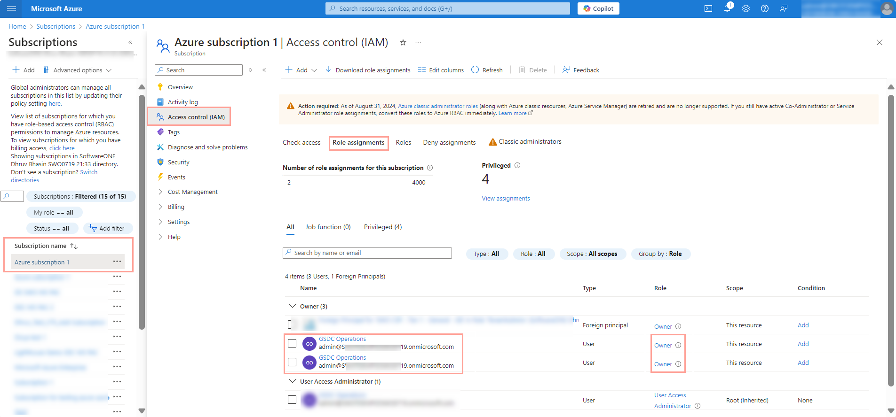

# How do I troubleshoot Lighthouse activation errors?

If you face an error when onboarding subscriptions to Azure Lighthouse, it could be due to your role within Azure.

Ensure you are the owner of the subscription to onboard and the first subscription onboarded to Azure Lighthouse.&#x20;

Subscription owners have the **Owner** role, listed on the **Role Assignments** tab in Azure.&#x20;

<figure><figcaption></figcaption></figure>

To complete the Lighthouse onboarding, you must also meet the following requirements for your primary domain/tenant or Azure subscription:

* **Role** - Any
* **User type** - Member
* **User principal name** - Must have no reference to 'external'
* **Identity** - Must match the tenant’s name for the partnership

<figure><figcaption></figcaption></figure>
