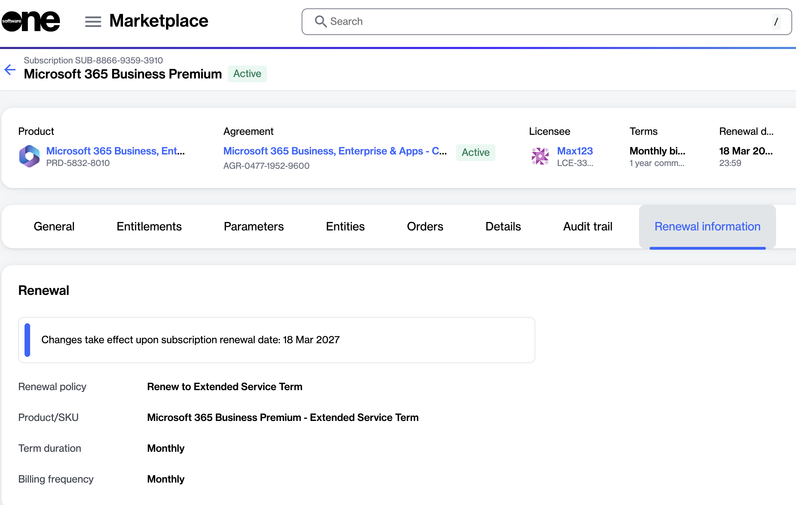
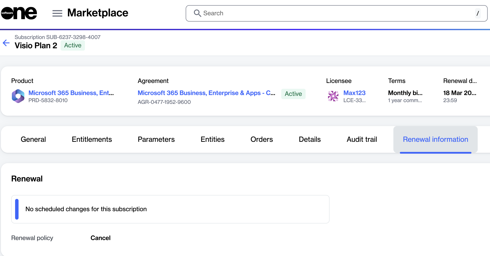
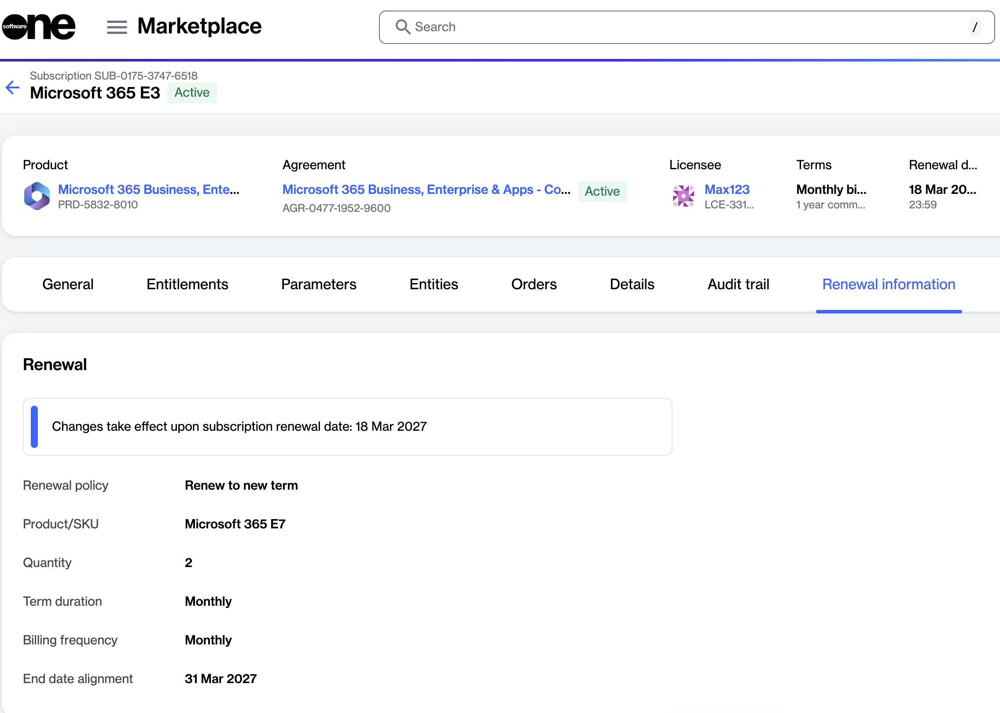

# How do I view subscription renewal information?

The **Renewal information** tab within subscription details shows how a subscription is configured to renew and any changes that are scheduled to take effect at the next renewal date.

To view renewal information:

1. Go to **Marketplace** > **Subscriptions**.
2. Select the subscription you want to review.
3. Select the **Renewal information** tab.
4. Review the renewal policy currently configured for the subscription.&#x20;

### What renewal policies can be displayed?

The **Renewal information** tab may display one of the following renewal policies:

<table><thead><tr><th width="218">Policy</th><th>Description</th></tr></thead><tbody><tr><td><strong>Renew to a new term</strong></td><td>The subscription renews for a new commitment term based on the configured renewal settings.</td></tr><tr><td><strong>Extend service terms</strong></td><td>The subscription converts to a monthly term that continues until you cancel or convert it to a regular subscription.</td></tr><tr><td><strong>Cancel</strong></td><td>The subscription ends at the end of its current commitment term and will not renew.</td></tr></tbody></table>

For more information on these policies, see [What subscription renewal options are available?](what-subscription-renewal-options-are-available.md).

### What renewal changes are displayed?

If changes are scheduled to occur when the subscription renews, the **Renewal information** tab displays the values that apply after renewal, including the SKU, commitment term, billing cycle, and quantity.&#x20;

This information helps you understand how the subscription will be configured after renewal.&#x20;

<figure><figcaption></figcaption></figure>

If no renewal changes are scheduled, the **Renewal information** tab displays only the current renewal policy.

<figure><figcaption></figcaption></figure>

### Why is the commitment end date different?

In some cases, the commitment end date shown in the **Renewal information** tab may differ from the current subscription end date.

This can occur when [subscription dates are aligned or cotermed](../../products-and-programs/microsoft-nce/about-subscription-coterminosity/coterming-subscriptions.md) with other subscriptions or a calendar month.

When this happens, the adjusted commitment end date is displayed so you can see the date that applies after renewal.

<figure><figcaption></figcaption></figure>

### Related topics


[what-subscription-renewal-options-are-available.md](what-subscription-renewal-options-are-available.md)



[how-to-disable-the-automatic-renewal-of-an-nce-subscription.md](../microsoft-365/how-to-disable-the-automatic-renewal-of-an-nce-subscription.md)



[coterming-subscriptions.md](../../products-and-programs/microsoft-nce/about-subscription-coterminosity/coterming-subscriptions.md)

