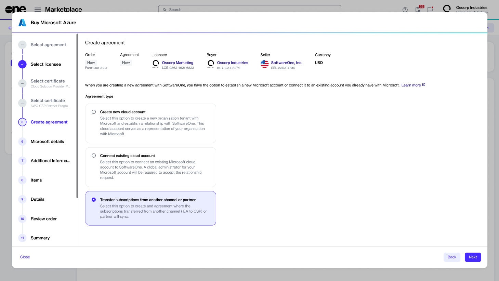
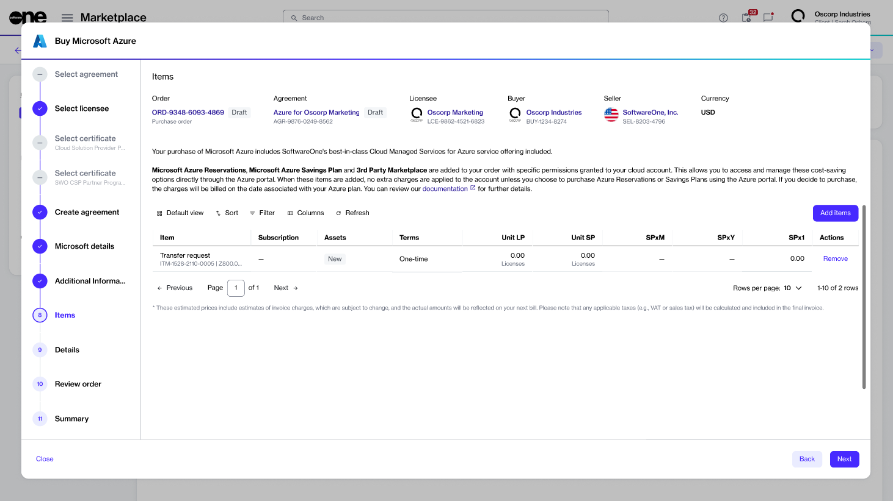

# How to transfer Microsoft subscriptions to SoftwareOne

The Marketplace Platform allows you to transfer your existing Microsoft subscriptions from another channel or partner to SoftwareOne. Subscription transfers are available for both user-based and pay-as-you-go subscriptions.&#x20;

Currently, the following transfer scenarios are supported:

* **CSP to CSP** - Allows you to transfer subscriptions between different CSP partners.
* **EA to CSP** - Allows you to move from an Enterprise Agreement to CSP (direct or indirect Microsoft business agreements).
* **Microsoft Direct (MCA) to CSP** - Allows you to transfer subscriptions from Microsoft Direct (MCA) to the CSP model.

This transfer process requires creating a new agreement in the SoftwareOne Marketplace using the Purchase Wizard and choosing the option to transfer your existing subscriptions. The following section describes the steps.

### Transferring subscriptions to SoftwareOne

Before starting the transfer process, ensure you have the tenant domain.

To transfer your subscriptions:

1. Sign in to the Marketplace Platform.
2. Navigate to the **Products** page. Then, select the desired **Microsoft** product you want to transfer (for example, **Microsoft Azure**).
3. On the product details page, select **Buy now**.
4. In the purchase wizard, complete the following steps:
   1. Select **Create agreement**.
   2. Choose an existing licensee from the list or [create a new one](../../../../modules-and-features/settings/licensees/create-licensees.md). Then, select **Next**.
   3.  Choose **Transfer subscriptions from another channel or Microsoft partner** and select **Next**.&#x20;

       
<figure><figcaption>
Transfer subscriptions from another channel or Microsoft partner.
</figcaption></figure>

   4. Enter your existing tenant or domain name (for example, `yourdomain.onmicrosoft.com`) and select **Next**.
   5. Confirm the **State Owned Entity** status, complete the support contact details, and choose a support language. When done, select **Next**.
   6.  Continue to the **Details** step by selecting **Next**.&#x20;

       

The <strong>Items</strong> step includes a <strong>Transfer Request</strong> line item, which is essential for initiating and processing the transfer. Do not remove this item, as the transfer cannot be completed without it.

       
<figure><figcaption>
Transfer request item for transferring subscriptions.
</figcaption></figure>

   7. Provide optional details, such as additional IDs or order notes, and select **Next**.
   8. Read the terms and conditions and the privacy statement. When done, select **Place order** to submit your purchase order for the transfer.
   9. Select **View order** to navigate to the order details page. Otherwise, select **Close**.

### Next steps

Once you place your order, we will contact you with the next steps to complete the transfer.

After the transfer is complete, you must accept our [GDAP relationship request](../../granular-delegated-admin-privileges-gdap/accept-a-gdap-relationship-request.md). GDAP is essential for SoftwareOne to manage your Microsoft services. To learn more, see [Granular Delegated Admin Privileges](../../granular-delegated-admin-privileges-gdap/).

Additionally, for Azure subscriptions, you must also [complete the Lighthouse onboarding process](../../azure-lighthouse/complete-the-azure-lighthouse-onboarding.md), so we can manage and support your Azure environment.
