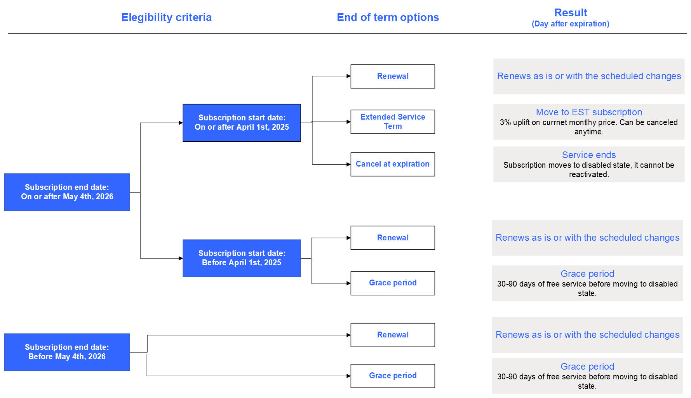
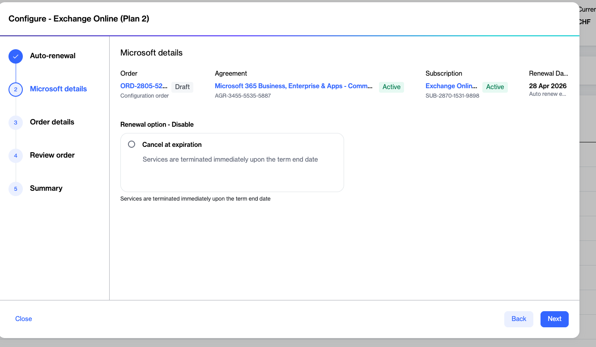
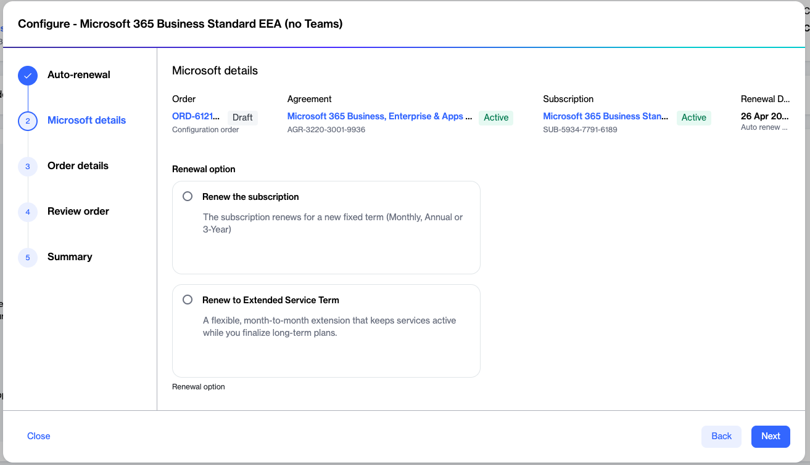

# What subscription renewal options are available

The SoftwareOne Marketplace provides self-service options for managing your CSP subscriptions. This topic describes what you can do when a subscription reaches its term's end and how to handle renewals in the Marketplace.

### Renewal options 

Your subscription renewal options in the Marketplace include renewing to a new term before the existing term ends, canceling at expiration, or moving to an Extended Service Term (EST).

**Renew to a new term** - This option allows you to renew your subscription for a new fixed term. This works like it always has, supporting scheduled changes as needed or renewing as is. For details on how to renew, see [Renewing to a new fixed term](what-subscription-renewal-options-are-available.md#renewing-to-a-new-fixed-term).

**Cancel at expiration** - This allows you to stop your services at the end of the subscription term. Once a subscription is cancelled, it can't be recovered or reactivated. For details on how to cancel, see [Canceling a subscription at expiration](what-subscription-renewal-options-are-available.md#cancelling-a-subscription-at-expiration).

**Move to EST** - This converts your subscription into a monthly term that continues until you cancel or convert it to a regular subscription. Once a subscription is converted to EST, no changes can be made. You can move a subscription to EST if it meets the following criteria:

* It's in the commercial or public sector (Education, Nonprofit, or Government Community Cloud).
* It falls under specialized offers.
* It includes end-of-sale items with conversion SKUs.
* It was purchased or renewed between April 1, 2025, and May 4, 2026, and has a term end date after May 4, 2026.

Trial subscriptions and end-of-sale SKUs are not eligible for EST. Additionally, EST bills monthly at the current monthly term rate plus a 3% uplift (or 23% if no monthly plan exists). For details on how to convert to an EST subscription, see [Moving to an Extended Service Term](what-subscription-renewal-options-are-available.md#moving-to-an-extended-service-term).

### Subscription renewal scenario

The following example illustrates how the subscription start and end dates affect the outcome, including renewal, EST, grace period, and cancellation:

<figure><figcaption>
Diagram showing subscription dates and end of term flow.
</figcaption></figure>

### Renewing to a new fixed term

To renew your subscription for a new fixed term:

1. Go to the **Subscriptions** page and select the required subscription.
2. On the **subscription details** page, select the arrow , then choose **Configure**.&#x20;
3. Choose **Enabled**, then select **Next**. &#x20;
4. Choose **Renew the subscription**, then select **Next**. &#x20;
5. Enter any required reference details and select **Next**.
6. Review the order and select **Place order**.
7. View the order details or close the summary page.

### Canceling a subscription at expiration

To cancel your subscription at the end of its term:

1. Go to the **Subscriptions** page and select the required subscription.
2. On the **subscription details** page, select the arrow , then choose **Configure**.&#x20;
3. Choose **Disabled**, then select **Next**.&#x20;
4. Choose **Cancel at expiration**, then select **Next**.

<figure><figcaption>
Cancel your subscription at the end of subscription term.
</figcaption></figure>

5. Enter any required reference details and select **Next**.
6. Review the order and select **Place order**.
7. View the order details or close the summary page.

### Moving to an Extended Service Term

To move your subscription to an extended service term:

1. Go to the **Subscriptions** page and select the required subscription.
2. On the **subscription details** page, select the arrow , then choose **Configure**.&#x20;
3. Choose **Enabled**, then select **Next**. &#x20;
4. Choose **Renew to Extended Service Term**, then select **Next**. &#x20;

<figure><figcaption>
Renew to a monthly Extended Service Term.
</figcaption></figure>

5. Enter any required reference details and select **Next**.
6. Review the order and select **Place order**.
7. View the order details or close the summary page.
