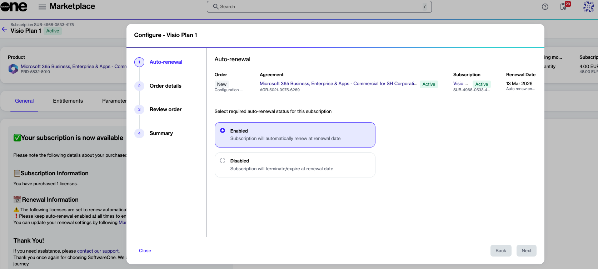

# What subscription renewal options are available

Effective February 16, 2026, Microsoft provides the following options for renewing subscriptions:

* **Renew the subscription** - This allows you to renew your subscription as it is or make scheduled changes.
* **Cancel at expiration** - This allows you to stop your services at the end of the subscription term. While your data is preserved, the subscription cannot be recovered or reactivated.
* **Renew to an Extended Service Term (EST)** - This new option converts your subscription into a monthly term that continues until you decide to cancel or convert it to a regular subscription. Once a subscription is converted to EST, license changes cannot be made. The extended service term bills monthly at the current monthly term rate plus a 3% uplift (or 23% if no monthly plan exists).

### Eligibility criteria for EST

You can use EST if your subscription meets the following criteria:

* It's in the commercial or public sector (Education, Nonprofit, or Government Community Cloud).
* It falls under specialized offers.
* It includes end-of-sale items with conversion SKUs.
* It was purchased or renewed between April 1, 2025, and May 4, 2026, and has a term end date after May 4, 2026.


Trial subscriptions and end-of-sale SKUs are not eligible for the extended service terms.


### Subscription renewal scenario

The following example illustrates how the subscription start and end dates affect the outcome, including renewal, extended service term, grace period, and cancellation:

<figure><figcaption>
Diagram showing subscription dates and end of term flow.
</figcaption></figure>

### Managing renewals in SoftwareOne Marketplace

In the SoftwareOne Marketplace, you can manage your subscription renewals through self-service. For details, see [How to renew or cancel your CSP subscriptions](how-to-renew-or-cancel-your-csp-subscriptions.md).

When managing renewal, the following options are available:&#x20;

* **Enabled** - Your subscription renews automatically as usual. You can choose whether you want to renew the subscription for a regular term or an extended service term. Extended Service Terms apply only to [eligible subscriptions](what-subscription-renewal-options-are-available.md#eligibility-criteria-for-est) that renew or expire after May 4, 2026.&#x20;
* **Disabled** - Your subscription ends on the expiration date. Once a subscription expires, it cannot be recovered.

<figure><figcaption>
Subscription auto renewal settings in SoftwareOne Marketplace.
</figcaption></figure>

