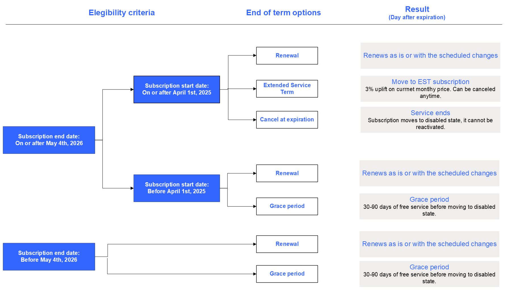
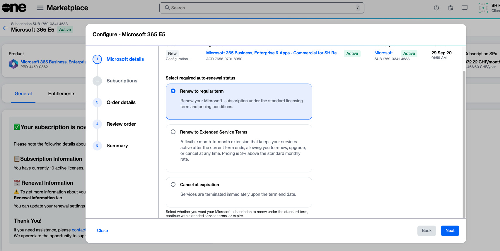

# What subscription renewal options are available?

The SoftwareOne Marketplace provides self-service options for managing your CSP subscriptions. This topic describes what you can do when a subscription reaches its term's end and how to handle renewals in the Marketplace.

### Renewal options 

Your subscription renewal options in the Marketplace include renewing to a new term before the existing term ends, moving to an Extended Service Term, or cancelling at expiration.

#### Renew to regular term

This option allows you to renew your subscription for a new fixed term. This works like it always has, supporting scheduled changes as needed or renewing as is.&#x20;

#### Renew to Extended Service Term

This converts your subscription into a monthly term that continues until you cancel or convert it to a regular subscription. Once a subscription is converted to EST, no changes can be made. You can move a subscription to EST if it meets the following criteria:

* It's in the commercial or public sector (Education, Nonprofit, or Government Community Cloud).
* It falls under specialized offers.
* It includes end-of-sale items with conversion SKUs.
* It was purchased or renewed between April 1, 2025, and May 4, 2026, and has a term end date after May 4, 2026.

Trial subscriptions and end-of-sale SKUs are not eligible for EST. Additionally, EST bills monthly at the current monthly term rate plus a 3% uplift (or 23% if no monthly plan exists).&#x20;

#### Cancel at expiration

This allows you to stop your services at the end of the subscription term. Once a subscription is cancelled, it can't be recovered or reactivated.

### Subscription renewal scenario

The following example illustrates how the subscription start and end dates affect the outcome, including renewal, EST, grace period, and cancellation:

<figure><figcaption>
Diagram showing subscription dates and end of term flow.
</figcaption></figure>

### Select a renewal option

When configuring a subscription renewal, select the renewal option that best meets your requirements.&#x20;

To select a renewal option:

1. Open the required subscription.
2. Select the dropdown arrow, then choose **Configure**.
3. Select **Renew to regular term**, **Renew to Extended Service Term**, or **Cancel at expiration**. Then, select **Next**.

<figure><figcaption>
Select the renewal option to apply when the subscription reaches the end of its current term.
</figcaption></figure>

4. Enter any required reference details and select **Next**.
5. Review the order and select **Place order**.
6. View the order details or close the summary page.

### Viewing the current renewal policy

You can view the renewal policy currently assigned to a subscription from either the subscription details or the [Microsoft accounts](../../microsoft-accounts.md) page.

#### View the renewal policy in subscription details

To view the renewal policy in subscription details:

1. Open the required subscription.
2. On the subscription details page, select the **Renewal information** tab.
3. Review the renewal policy currently assigned to the subscription.

#### View the renewal policy from Microsoft accounts

To view the renewal policy using Microsoft accounts:

1. From the main menu, select **Microsoft accounts**.
2. Select the CSP tenant that contains the subscription.
3. In the subscriptions list, locate the **Renewal policy** column.
4. Review the value displayed for the subscription.
