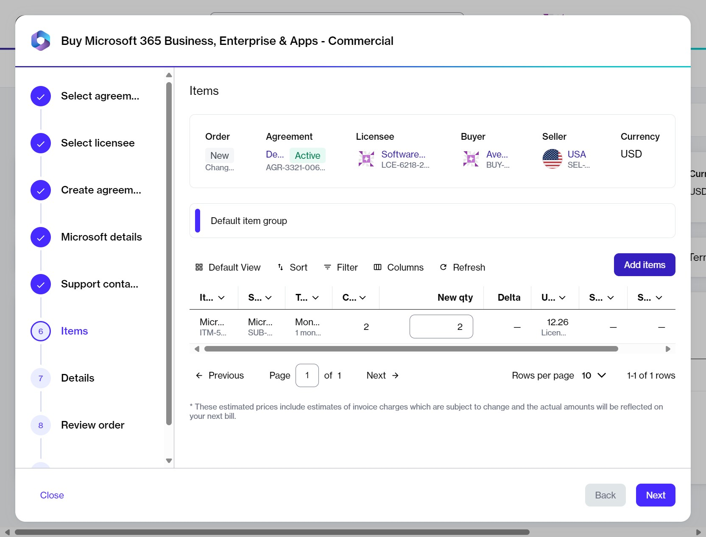

# Add new items to an agreement

This tutorial explains how to add new Microsoft items to your existing CSP agreement in the SoftwareOne Marketplace.&#x20;

This scenario focuses on finding and adding an item called _Microsoft Power BI._&#x20;

### Prerequisites 

Make sure that the agreement you want to use is active.&#x20;

### Add new items to an agreement



**Open the required agreement**&#x20;

To open the agreement:&#x20;

1. Go to **Marketplace** > **Agreements**.
2. Select the agreement.&#x20;



**Add new items**

To add new items:

1. On the agreement details page, select **Buy more**. The guided purchase flow starts, and the **Items** step is displayed.
2. Select **Add items**.

<figure><figcaption>
The option to add new items to your order.
</figcaption></figure>

3. Use filters to find the required items. In this example, search for _Power BI_ using the following steps:
   1. Select the <path d=&#x22;M400-240v-80h160v80H400ZM240-440v-80h480v80H240ZM120-640v-80h720v80H120Z&#x22;/></svg>" data-size="line"> **Filter** option in the grid.
   2. Select **Add another condition** and then use the dropdown to make the following selections:&#x20;
      1. Select **Product Item Name**.
      2. Set the filter to **Contains**.
      3. Type the name of the required product (in this case, _Power BI_).
      4. **Close** the filter box.
4. Select the items from the list. You can select multiple items.


When selecting items, be sure to verify the billing terms and the duration of the subscription.


5. Select **Add items**. The items are added, and the **Select items** page is displayed.
6. In the **New qty** field, set the quantity of your newly added items. Then, select **Next**.&#x20;


In this step, you can also increase the quantities of the existing items.




**Submit your order**

1. **Details** – Add any reference details or comments, then select **Next**.
2. **Review order** – Review the order details, terms and conditions, and privacy statement, then select **Place order**.
3. **Summary** – Select **View details** to open the order details page or select **Close**.



### Next steps

You can check the status of your new order on the **Orders** page or in the **Orders** tab on the agreement details page.

Once you place the order, the agreement status changes from **Active** to **Updating**. You won't be able to place any additional orders under this agreement until your current order has been processed and the agreement status is changed back to **Active**.&#x20;

### Related tasks


[order-microsoft-365-subscription-new-tenant.md](order-microsoft-365-subscription-new-tenant.md)



[order-microsoft-365-subscription-existing-tenant.md](order-microsoft-365-subscription-existing-tenant.md)



[buy-more-licenses-for-microsoft-365-subscription.md](buy-more-licenses-for-microsoft-365-subscription.md)



[terminate-all-microsoft-subscriptions.md](terminate-all-microsoft-subscriptions.md)



[terminate-microsoft-subscription.md](terminate-microsoft-subscription.md)



[how-to-disable-the-automatic-renewal-of-an-nce-subscription.md](how-to-disable-the-automatic-renewal-of-an-nce-subscription.md)

