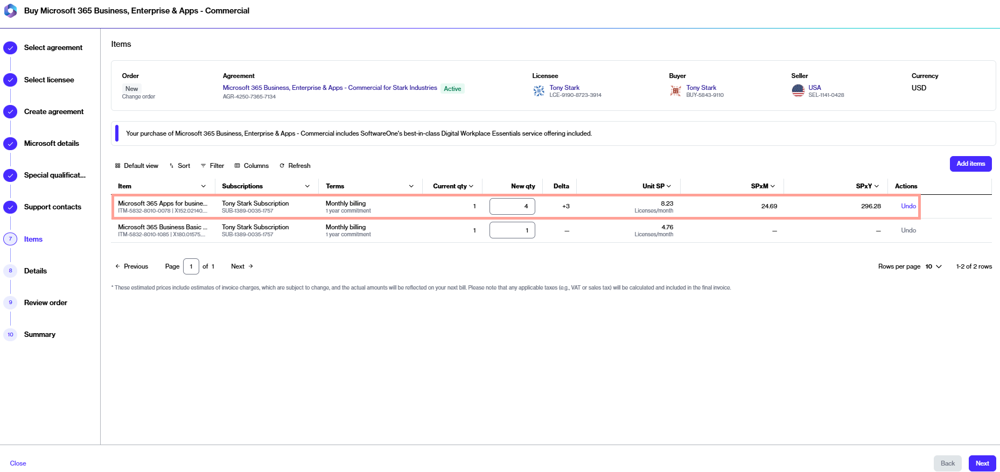

# Purchase additional Microsoft 365 licenses

This tutorial describes how you can order additional licenses for an existing Microsoft 365 subscription. Additional licenses can be ordered by placing a change order for the agreement.&#x20;


Watch this video guide explaining how to buy more licenses for an existing 365 subscription.


### Prerequisites

Before starting this tutorial, make sure that the agreement you want to use is currently active.

### Purchase additional licenses for a Microsoft 365 subscription 





To start the process:

1. Go to **Catalog** > **Products**.
2. Select the desired Microsoft 365 product, for example, **Microsoft 365 Business, Enterprise & Apps**.
3. On the details page, review the product information, then select **Buy now**.&#x20;



**Select the agreement and change the license quantities**

Complete the following steps:

1. **Create agreement** – Choose an active agreement, then select **Next**.&#x20;
2. **Items** – Enter the total number of licenses in the **New qty** field. For example, if you have 1 license and you want to add 3 more, enter the new quantity as 4. When done, select **Next**.

<figure><figcaption>
Enter the new quantity of licenses for the subscription.
</figcaption></figure>

3. **Details** – Add reference details and your comments, then select **Next**.
4. **Review order** – Read the terms and conditions and the privacy statement. When done, select **Place order** to submit your order.
5. **Summary** – Select **View details** to open the order details page or select **Close**.



### Next steps 

Once you place your order, we verify the details.

You can track your order on the order details page. The **General** tab on the order details page outlines the next steps.

### Related tasks


[order-microsoft-365-subscription-new-tenant.md](order-microsoft-365-subscription-new-tenant.md)



[order-microsoft-365-subscription-existing-tenant.md](order-microsoft-365-subscription-existing-tenant.md)



[add-new-products-to-your-csp-agreement.md](add-new-products-to-your-csp-agreement.md)



[terminate-all-microsoft-subscriptions.md](terminate-all-microsoft-subscriptions.md)



[terminate-microsoft-subscription.md](terminate-microsoft-subscription.md)

